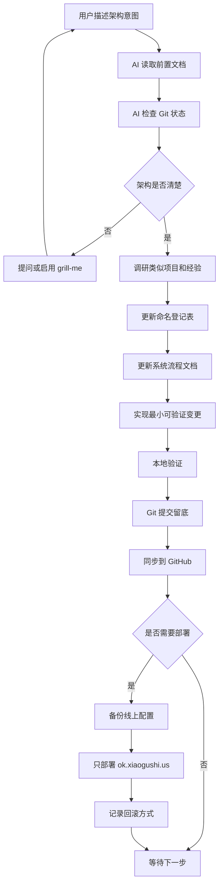
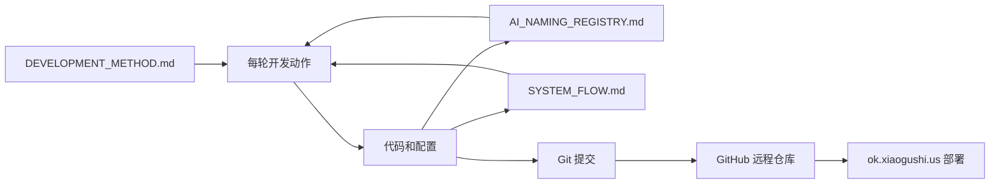
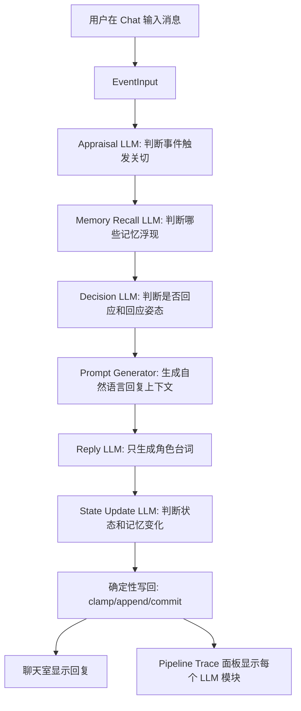
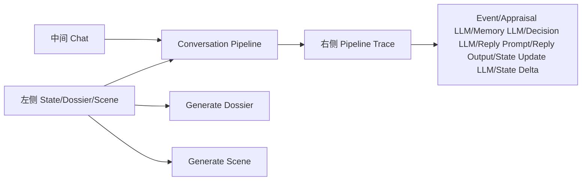

# System Flow

本文档说明系统如何运作、数据如何流动、模块之间如何调用。它既给用户看，也给 AI 后续开发使用。

## 当前阶段

当前已建立第一版本地 MVP：三栏工作台展示人物状态、聊天室和 pipeline debug。系统能一键根据描述生成人物档案，一键生成场景，并在发送消息后展示多模块 LLM 数据流。

重要约束：Reply LLM 只接收自然语言上下文，只生成角色说出口的话。不能把 JSON、字段名、输出契约、工程术语或类似编程语言的内容混进这一步。

认知模块是另一类 LLM 调用。Appraisal、Memory Recall、Decision、State Update 都是独立的脑区式 LLM 模块；它们可以用结构化输入/输出约束，因为它们不是角色台词生成器，而是系统内部的判断模块。

## 总体工作流

## 文档和代码关系

## 当前 MVP 同步响应路径

## 当前 UI 结构

## 待确认 MVP 架构问题

开始写业务代码前，需要确认以下信息：

1. MVP 第一版要让用户看到什么可运行结果？
2. 虚拟人的核心能力是什么：对话、记忆、情绪、任务执行、声音、形象，还是其中一部分？
3. 第一版是否需要登录系统？
4. 第一版数据是否需要长期保存？
5. 是否必须接入大模型 API？如果是，使用哪个供应商？
6. 是否已有 UI 草图、流程图或前一段对话内容？
7. GitHub 仓库名称和可见性是什么？

## 当前外部资源

| 资源 | 状态 | 说明 |
| --- | --- | --- |
| 前置对话链接 | blocked | 链接打开后需要登录，AI 无法读取实际内容 |
| GitHub 账号 | known | 用户主页为 `ttmanthatman`，仓库名未确认 |
| VPS | known | 仅允许后续部署 `ok.xiaogushi.us` 对应内容 |
| 域名 | known | `ok.xiaogushi.us` |

## 当前模块状态

| 模块 | 状态 | 说明 |
| --- | --- | --- |
| 开发方法 | initialized | 已建立规则文档 |
| 命名登记 | initialized | 已建立 AI 用命名表 |
| 系统流程 | initialized | 已建立初始工作流图 |
| MVP 业务模块 | initialized | 已实现本地可运行的三栏工作台 |
| 人物档案生成 | initialized | 基于描述生成 profile 和 concerns，目前为规则版 |
| 场景生成 | initialized | 基于描述生成 scene，目前为规则版 |
| 同步对话路径 | initialized | Event -> Appraisal LLM -> Memory LLM -> Decision LLM -> Reply Prompt -> Reply Output -> State Update LLM -> State Delta |
| 真实 LLM 接入 | pending | 当前为 mock adapter；正式运行需要后端代理和 API Key，每个认知模块都应调用 LLM |
| 异步生命路径 | pending | Memory Consolidation、Concern Decay、Internal Monologue、Proactive Scheduler 尚未实现 |
