# System Flow

本文档说明系统如何运作、数据如何流动、模块之间如何调用。它既给用户看，也给 AI 后续开发使用。

## 当前阶段

当前已建立第一版本地 MVP：三栏工作台展示分组多人档案、人物状态、当前位置、聊天室和流程追踪。系统能根据用户素材预览人物档案和配套场景，并在发送消息后展示多模块 LLM 数据流。

当前系统已接入登录和权限边界。未登录用户可以看到完整工作台界面，但发送消息、切换档案、生成或应用档案、保存 DeepSeek 密钥、测试 DeepSeek、查看审计等操作会打开登录浮窗。登录账号来自 `LIAO_CHATROOM_ORIGIN` 配置的聊天室用户；本项目只调用 liao 聊天室 `/api/login` 校验用户名和密码，不保存密码，不修改聊天室数据。

管理员权限沿用 liao 聊天室登录结果里的 `isAdmin`。只有管理员可以新增、保存、删除或应用共享多人档案，也可以修改档案分组；普通登录用户只能读取、选择和使用管理员保存的共享档案。用户对话时的聊天内容、短期记忆、runtime 状态和关系变化只在当前浏览器会话内写回，不自动覆盖后台共享档案。

系统启动时会合并 `builtinPersonaDossiers.mjs` 中的内置全局档案和 `.persona-dossiers.local.json` 中管理员保存的共享档案。当前内置 14 个档案：7 个“马可福音10”人物和 7 个“郑州市”人物；每个档案都包含人物、成长背景、场景、分组和位置属性。管理员删除内置档案时不会改源码，而是在运行时存储里记录 tombstone。

后台会记录每个登录用户的一次输入和虚拟人输出。审计记录写入 `.conversation-audits.local.json`，共享档案写入 `.persona-dossiers.local.json`；二者都是运行时文件，被 `.gitignore` 忽略，只有管理员可以通过 `/api/conversation-audits` 读取、删除单条或清空审计。

重要约束：Reply LLM 只接收自然语言上下文，只生成角色说出口的话。不能把 JSON、字段名、输出契约、工程术语或类似编程语言的内容混进这一步。

认知模块是另一类 LLM 调用。Appraisal、Memory Recall、Decision、State Update 都是独立的脑区式 LLM 模块；它们可以用结构化输入/输出约束，因为它们不是角色台词生成器，而是系统内部的判断模块。

真实 LLM 的结构化输出必须先经过确定性归一化，再交给下游模块。Appraisal、Memory Recall、Decision 和 State Update 都有模块出口归一化层，用来处理数组缺失、关系对象变成字符串、未知 concern id、枚举漂移等情况。归一化层不能改变 Reply LLM 的自然语言边界，它只保护内部认知模块的数据契约。

Memory Recall 不是敏感词召回。触发词可以作为线索，但记忆浮现必须同时参考自然语言相关度、当前关切、说话者关系、情绪显著、近期性和词面线索。当前同步路径先在本地构建混合召回候选，再交给 Memory Recall LLM 复判；未来异步生命路径也复用同一套召回上下文，只是 `source` 从 `sync_response` 变成 `async_life`。

左侧 UI 里的性格标签、能量、情绪、情绪倾向、唤醒度和当前位置是给人快速观察的摘要。它们由专门的 Runtime Signal Evaluation LLM 模块、种子档案或管理员维护字段提供，不由 Reply LLM 直接控制台词。提交给 Reply LLM 的是 `personalitySummary`、`personalityFacets`、`runtime.signalProfiles.*.cognitiveNarrative`、`scene.cognitiveNarrative`、`characterLocation` 和 `mapContext` 等自然语言综合描述。

人物属性、状态信号和场景叙述只描述内部倾向、形成原因、身体感、关系距离和注意力落点，不能写成“回复应如何”“不要如何”“用什么话术”这类直接指令。Reply Prompt 的作用是把这些自然语言材料过一遍，让回复从人物整体状态中长出来，而不是让某个单独指标指挥台词风格。

人物档案和场景预览也属于认知模块，不是本地字符串拼接。人物档案预览通过 Dossier Interpretation LLM 将用户素材拆成展示摘要、长期记忆、人性/人格、标签、关切和状态信号；场景预览通过 Scene Interpretation LLM 将用户素材拆成场景摘要、状态影响和人物影响。预览应用时写入的是 LLM 解读后的结构化状态，而不是用户原文。

人物档案和场景设置作为 `personaDossier` 成组保存。左侧可以按 `personaDossierGroup` 分组展示、新建、切换和删除档案；切换档案时人物状态、人物素材、场景素材和位置属性一起切换。应用人物或场景预览前，Profile Scene Consistency LLM 会判断人物与场景是否处于同一世界观、时代和社会语境；现代人物进入古代场景这类硬冲突需要输入本地“扭曲时空密码”才能继续。

DeepSeek 接入必须关闭思考模式。应用固定使用真实 DeepSeek 本地代理和 `deepseek-v4-flash`，不再暴露模拟语言模型选项。代理层对所有 DeepSeek Chat Completions 请求显式传入 `thinking: { type: "disabled" }`，不发送 `reasoning_effort`，并把 `deepseek-reasoner` 纠正为 `deepseek-v4-flash`。

流程追踪面板不是事后 dump。每个模块开始时会自动切换到当前步骤，并显示该模块的输入、流式输出和状态。每个步骤都必须让用户能分清“发给模块的输入”和“模块返回的输出”。

## 总体工作流

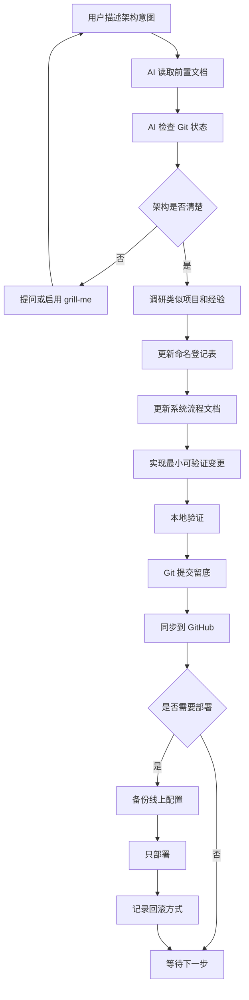
```mermaid
flowchart TD
    A[用户描述架构意图] --> B[AI 读取前置文档]
    B --> C[AI 检查 Git 状态]
    C --> D{架构是否清楚}
    D -- 否 --> E[提问或启用 grill-me]
    E --> A
    D -- 是 --> F[调研类似项目和经验]
    F --> G[更新命名登记表]
    G --> H[更新系统流程文档]
    H --> I[实现最小可验证变更]
    I --> J[本地验证]
    J --> K[Git 提交留底]
    K --> L[同步到 GitHub]
    L --> M{是否需要部署}
    M -- 是 --> N[备份线上配置]
    N --> O[只部署 <production-domain>]
    O --> P[记录回滚方式]
    M -- 否 --> Q[等待下一步]
    P --> Q
```

## 文档和代码关系

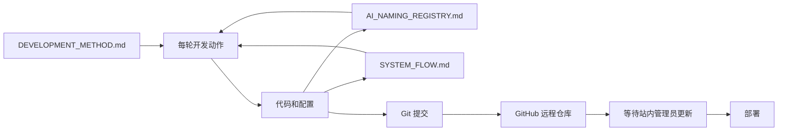
```mermaid
flowchart LR
    DM[DEVELOPMENT_METHOD.md] --> WORK[每轮开发动作]
    NR[AI_NAMING_REGISTRY.md] --> WORK
    SF[SYSTEM_FLOW.md] --> WORK
    WORK --> CODE[代码和配置]
    CODE --> NR
    CODE --> SF
    CODE --> GIT[Git 提交]
    GIT --> GH[GitHub 远程仓库]
    GH --> WAIT[等待站内管理员更新]
    WAIT --> VPS[<production-domain> 部署]
```

## 生产部署路径

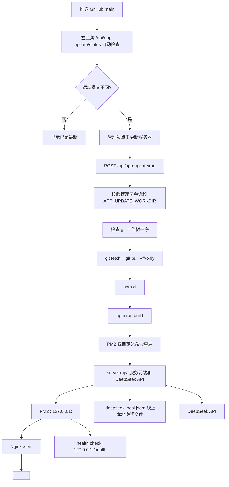
```mermaid
flowchart TD
    G[推送 GitHub main] --> CHECK[左上角 /api/app-update/status 自动检查]
    CHECK --> NEW{远端提交不同?}
    NEW -- 否 --> IDLE[显示已是最新]
    NEW -- 是 --> ADMIN[管理员点击更新服务器]
    ADMIN --> API[POST /api/app-update/run]
    API --> VERIFY[校验管理员会话和 APP_UPDATE_WORKDIR]
    VERIFY --> CLEAN[检查 git 工作树干净]
    CLEAN --> PULL[git fetch + git pull --ff-only]
    PULL --> INSTALL[npm ci]
    INSTALL --> BUILD[npm run build]
    BUILD --> RESTART[PM2 或自定义命令重启]
    RESTART --> SRV[server.mjs: 服务前端和 DeepSeek API]
    SRV --> PM2[PM2 <production-pm2-name>: 127.0.0.1:<production-port>]
    PM2 --> NGINX[Nginx <production-domain>.conf]
    NGINX --> SITE[<production-url>]
    SRV --> KEY[.deepseek.local.json: 线上本地密钥文件]
    SRV --> DS[DeepSeek API]
    PM2 --> HEALTH[health check: 127.0.0.1:<production-port>/health]
```

生产不再由 GitHub Actions push 自动部署。服务器通过 `APP_UPDATE_WORKDIR` 指向 VPS 上的 git clone 工作树，左上角自动检查远端分支是否有新提交；只有管理员可以触发 `/api/app-update/run`。更新过程会在站内窗口显示步骤、stdout/stderr 和进度。`LIAO_CHATROOM_ORIGIN`、`APP_UPDATE_WORKDIR`、`APP_UPDATE_PM2_NAME` 或 `APP_UPDATE_RESTART_COMMAND` 等生产环境变量留在 VPS，不写入仓库。

## 当前 MVP 同步响应路径

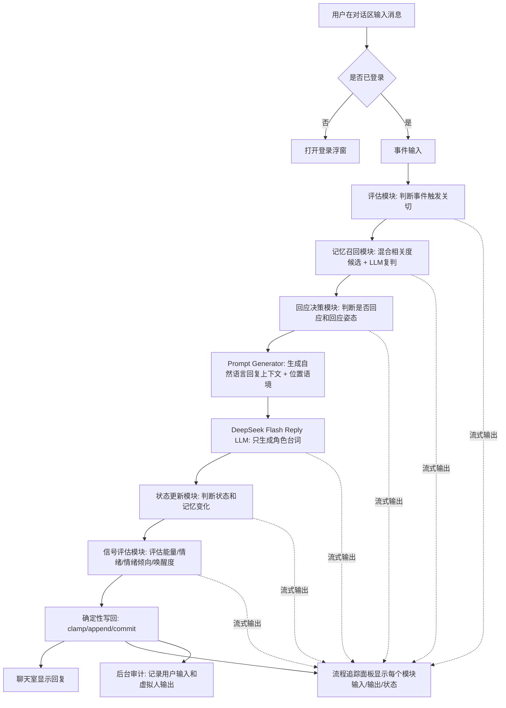
```mermaid
flowchart TD
    U[用户在对话区输入消息] --> AUTH{是否已登录}
    AUTH -- 否 --> LOGIN[打开登录浮窗]
    AUTH -- 是 --> E[事件输入]
    E --> A[评估模块: 判断事件触发关切]
    A --> M[记忆召回模块: 混合相关度候选 + LLM复判]
    M --> D[回应决策模块: 判断是否回应和回应姿态]
    D --> P[Prompt Generator: 生成自然语言回复上下文 + 位置语境]
    P --> R[DeepSeek Flash Reply LLM: 只生成角色台词]
    R --> S[状态更新模块: 判断状态和记忆变化]
    S --> G[信号评估模块: 评估能量/情绪/情绪倾向/唤醒度]
    G --> W[确定性写回: clamp/append/commit]
    W --> C[聊天室显示回复]
    W --> T[流程追踪面板显示每个模块输入/输出/状态]
    W --> AUDIT[后台审计: 记录用户输入和虚拟人输出]
    A -. 流式输出 .-> T
    M -. 流式输出 .-> T
    D -. 流式输出 .-> T
    R -. 流式输出 .-> T
    S -. 流式输出 .-> T
    G -. 流式输出 .-> T
```

## 登录与权限路径

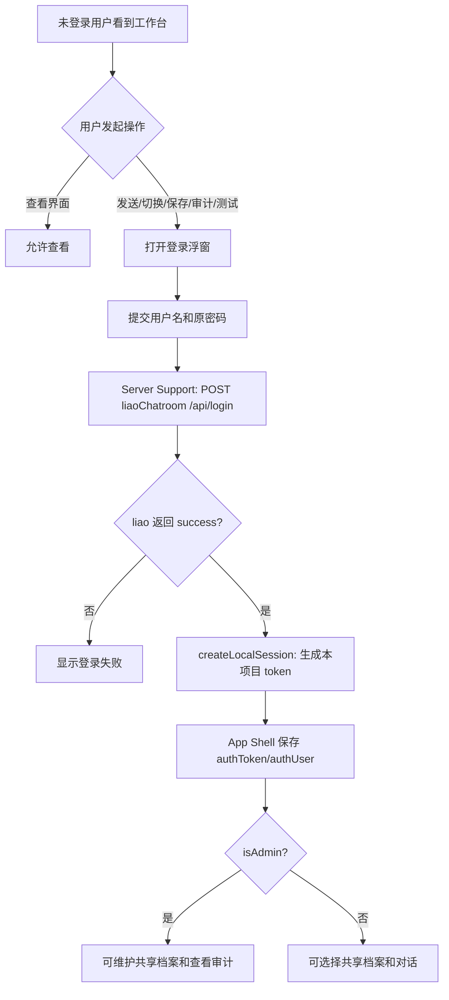
```mermaid
flowchart TD
    A[未登录用户看到工作台] --> B{用户发起操作}
    B -- 查看界面 --> C[允许查看]
    B -- 发送/切换/保存/审计/测试 --> D[打开登录浮窗]
    D --> E[提交用户名和原密码]
    E --> F[Server Support: POST liaoChatroom /api/login]
    F --> G{liao 返回 success?}
    G -- 否 --> H[显示登录失败]
    G -- 是 --> I[createLocalSession: 生成本项目 token]
    I --> J[App Shell 保存 authToken/authUser]
    J --> K{isAdmin?}
    K -- 是 --> L[可维护共享档案和查看审计]
    K -- 否 --> M[可选择共享档案和对话]
```

本项目的本地 `authSession` 存在内存中，服务重启后需要重新登录。上游 liao token 不返回前端，也不写入仓库；用户密码只在登录请求中转发给 `LIAO_CHATROOM_ORIGIN` 配置的 liao 聊天室校验。

## 记忆召回路径

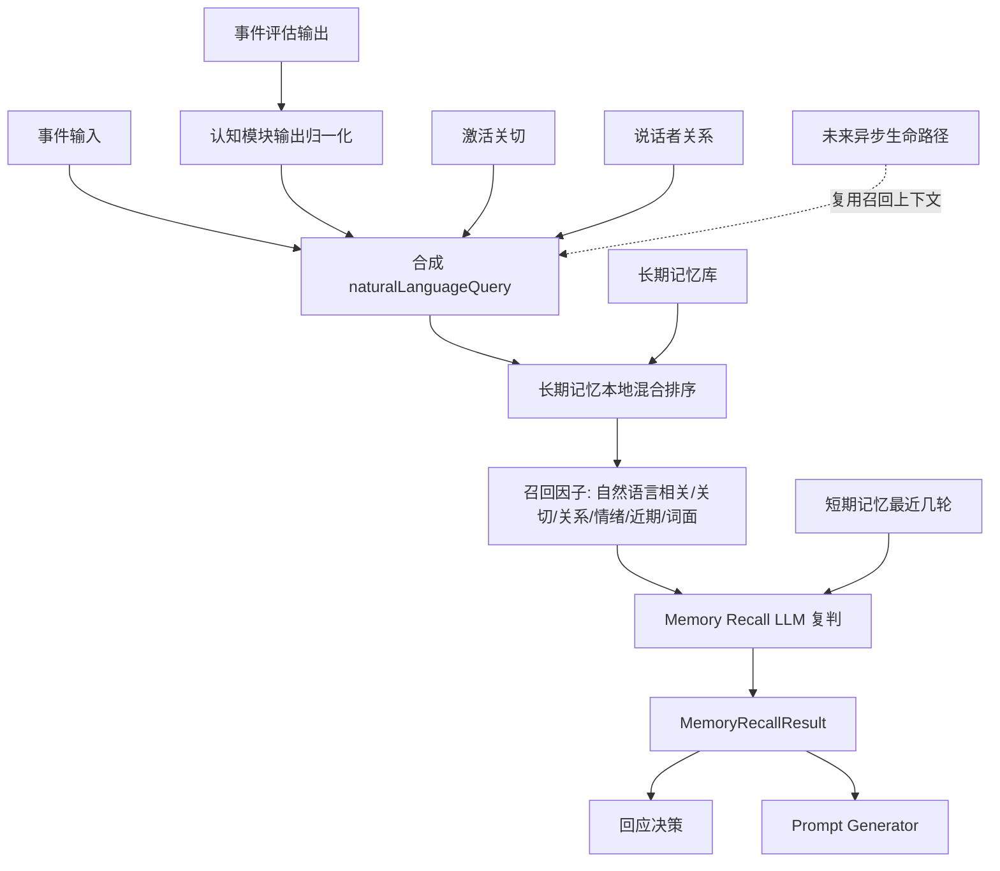
```mermaid
flowchart TD
    E[事件输入] --> Q[合成 naturalLanguageQuery]
    A[事件评估输出] --> N[认知模块输出归一化]
    N --> Q
    C[激活关切] --> Q
    R[说话者关系] --> Q
    Q --> S[长期记忆本地混合排序]
    L[长期记忆库] --> S
    S --> F[召回因子: 自然语言相关/关切/关系/情绪/近期/词面]
    F --> M[Memory Recall LLM 复判]
    B[短期记忆最近几轮] --> M
    M --> O[MemoryRecallResult]
    O --> D[回应决策]
    O --> P[Prompt Generator]
    X[未来异步生命路径] -. 复用召回上下文 .-> Q
```

本地混合排序只是候选层，不是最终心理判断。它的责任是避免把整个历史粗暴塞给模型，同时避免只按敏感词命中决定召回。Memory Recall LLM 可以提升“没有词面命中但语义相关”的记忆，也可以压低“只是撞词但语义无关”的记忆。

## 生成预览路径

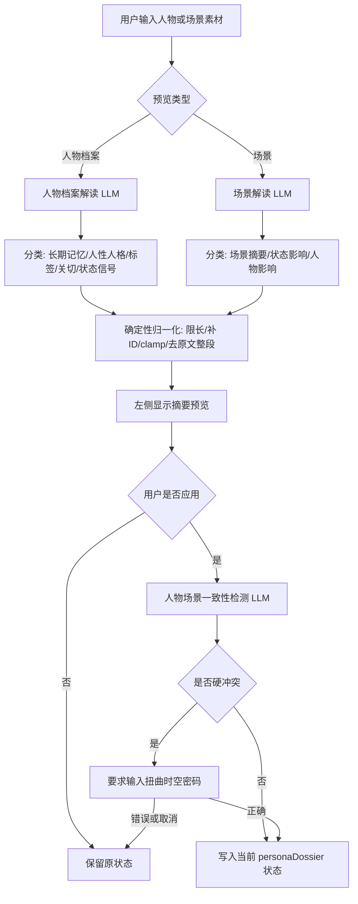
```mermaid
flowchart TD
    A[用户输入人物或场景素材] --> B{预览类型}
    B -- 人物档案 --> D[人物档案解读 LLM]
    B -- 场景 --> E[场景解读 LLM]
    D --> D1[分类: 长期记忆/人性人格/标签/关切/状态信号]
    E --> E1[分类: 场景摘要/状态影响/人物影响]
    D1 --> F[确定性归一化: 限长/补 ID/clamp/去原文整段]
    E1 --> F
    F --> G[左侧显示摘要预览]
    G --> H{用户是否应用}
    H -- 否 --> J[保留原状态]
    H -- 是 --> K[人物场景一致性检测 LLM]
    K --> L{是否硬冲突}
    L -- 否 --> I[写入当前 personaDossier 状态]
    L -- 是 --> M[要求输入扭曲时空密码]
    M -- 正确 --> I
    M -- 错误或取消 --> J
```

## 多人档案路径

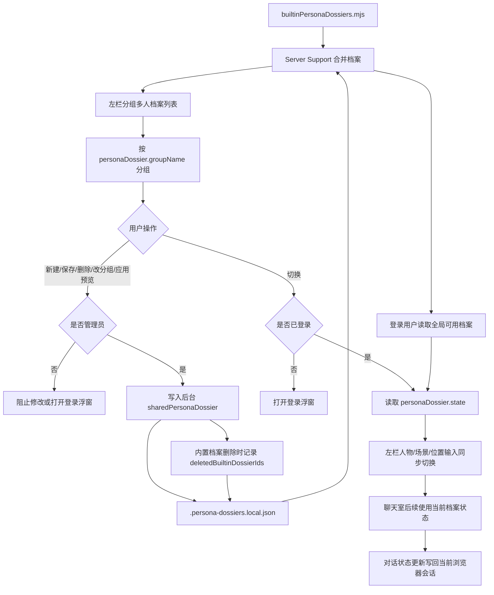
```mermaid
flowchart TD
    BUILTIN[builtinPersonaDossiers.mjs] --> MERGE[Server Support 合并档案]
    STORE[.persona-dossiers.local.json] --> MERGE
    MERGE --> A[左栏分组多人档案列表]
    A --> GROUP[按 personaDossier.groupName 分组]
    GROUP --> B{用户操作}
    B -- 新建/保存/删除/改分组/应用预览 --> ADMIN{是否管理员}
    ADMIN -- 否 --> BLOCK[阻止修改或打开登录浮窗]
    ADMIN -- 是 --> C[写入后台 sharedPersonaDossier]
    B -- 切换 --> LOGIN{是否已登录}
    LOGIN -- 否 --> POP[打开登录浮窗]
    LOGIN -- 是 --> D[读取 personaDossier.state]
    C --> STORE
    C --> TOMBSTONE[内置档案删除时记录 deletedBuiltinDossierIds]
    TOMBSTONE --> STORE
    MERGE --> READ[登录用户读取全局可用档案]
    READ --> D
    D --> H[左栏人物/场景/位置输入同步切换]
    H --> I[聊天室后续使用当前档案状态]
    I --> J[对话状态更新写回当前浏览器会话]
```

内置档案和管理员保存的多人档案都是全局可用初始档案。普通用户选择它之后可以对话使用；对话产生的聊天内容、短期记忆、runtime 状态和关系变化不自动写回 `.persona-dossiers.local.json`。

## 对话审计路径

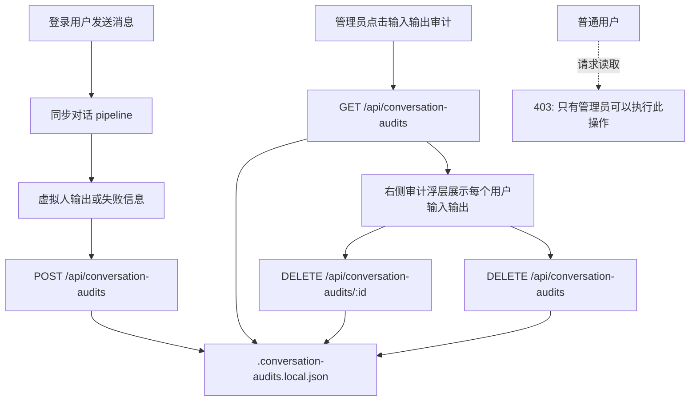
```mermaid
flowchart TD
    U[登录用户发送消息] --> PIPE[同步对话 pipeline]
    PIPE --> OUT[虚拟人输出或失败信息]
    OUT --> AUDIT[POST /api/conversation-audits]
    AUDIT --> STORE[.conversation-audits.local.json]
    ADMIN[管理员点击输入输出审计] --> READ[GET /api/conversation-audits]
    READ --> STORE
    READ --> UI[右侧审计浮层展示每个用户输入输出]
    UI --> DELONE[DELETE /api/conversation-audits/:id]
    UI --> CLEAR[DELETE /api/conversation-audits]
    DELONE --> STORE
    CLEAR --> STORE
    USER[普通用户] -. 请求读取 .-> DENY[403: 只有管理员可以执行此操作]
```

## 生成预览写回边界

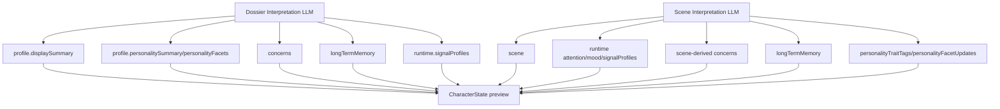
```mermaid
flowchart TD
    A[Dossier Interpretation LLM] --> B[profile.displaySummary]
    A --> C[profile.personalitySummary/personalityFacets]
    A --> D[concerns]
    A --> E[longTermMemory]
    A --> F[runtime.signalProfiles]
    S[Scene Interpretation LLM] --> T[scene]
    S --> U[runtime attention/mood/signalProfiles]
    S --> V[scene-derived concerns]
    S --> W[longTermMemory]
    S --> X[personalityTraitTags/personalityFacetUpdates]
    B --> Z[CharacterState preview]
    C --> Z
    D --> Z
    E --> Z
    F --> Z
    T --> Z
    U --> Z
    V --> Z
    W --> Z
    X --> Z
```

## 模块级流程图

以下流程图按 `docs/AI_NAMING_REGISTRY.md` 的模块登记表逐一展开。每张图只说明该模块自己的输入、内部步骤、输出和主要下游，方便逐个检查边界。

### App Shell

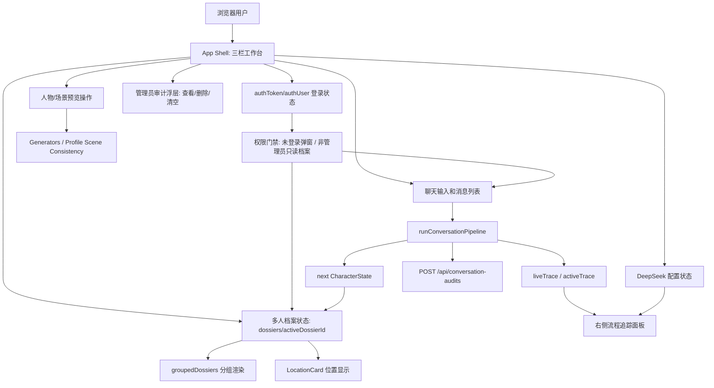
```mermaid
flowchart TD
    U["浏览器用户"] --> UI["App Shell: 三栏工作台"]
    UI --> AUTH["authToken/authUser 登录状态"]
    UI --> DOS["多人档案状态: dossiers/activeDossierId"]
    DOS --> GROUPS["groupedDossiers 分组渲染"]
    DOS --> LOCUI["LocationCard 位置显示"]
    UI --> CFG["DeepSeek 配置状态"]
    UI --> CHAT["聊天输入和消息列表"]
    AUTH --> GATE["权限门禁: 未登录弹窗 / 非管理员只读档案"]
    GATE --> CHAT
    GATE --> DOS
    CHAT --> PIPE["runConversationPipeline"]
    PIPE --> TRACE["liveTrace / activeTrace"]
    PIPE --> STATE["next CharacterState"]
    STATE --> DOS
    PIPE --> AUDIT["POST /api/conversation-audits"]
    TRACE --> PANEL["右侧流程追踪面板"]
    CFG --> PANEL
    UI --> PREVIEW["人物/场景预览操作"]
    PREVIEW --> GEN["Generators / Profile Scene Consistency"]
    UI --> ADMIN["管理员审计浮层: 查看/删除/清空"]
```

### Core Types

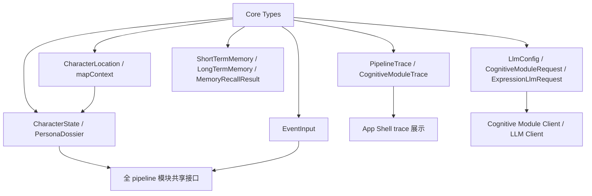
```mermaid
flowchart TD
    TYPES["Core Types"] --> STATE["CharacterState / PersonaDossier"]
    TYPES --> LOCATION["CharacterLocation / mapContext"]
    TYPES --> EVENT["EventInput"]
    TYPES --> TRACE["PipelineTrace / CognitiveModuleTrace"]
    TYPES --> MEMORY["ShortTermMemory / LongTermMemory / MemoryRecallResult"]
    TYPES --> LLM["LlmConfig / CognitiveModuleRequest / ExpressionLlmRequest"]
    STATE --> MODULES["全 pipeline 模块共享接口"]
    LOCATION --> STATE
    EVENT --> MODULES
    TRACE --> UI["App Shell trace 展示"]
    LLM --> CLIENTS["Cognitive Module Client / LLM Client"]
```

### Seed State

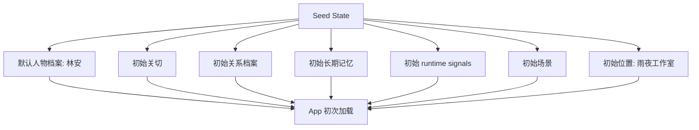
```mermaid
flowchart TD
    SEED["Seed State"] --> PROFILE["默认人物档案: 林安"]
    SEED --> CONCERNS["初始关切"]
    SEED --> REL["初始关系档案"]
    SEED --> MEM["初始长期记忆"]
    SEED --> RUNTIME["初始 runtime signals"]
    SEED --> SCENE["初始场景"]
    SEED --> LOCATION["初始位置: 雨夜工作室"]
    PROFILE --> APP["App 初次加载"]
    CONCERNS --> APP
    REL --> APP
    MEM --> APP
    RUNTIME --> APP
    SCENE --> APP
    LOCATION --> APP
```

### Cognitive Module Client

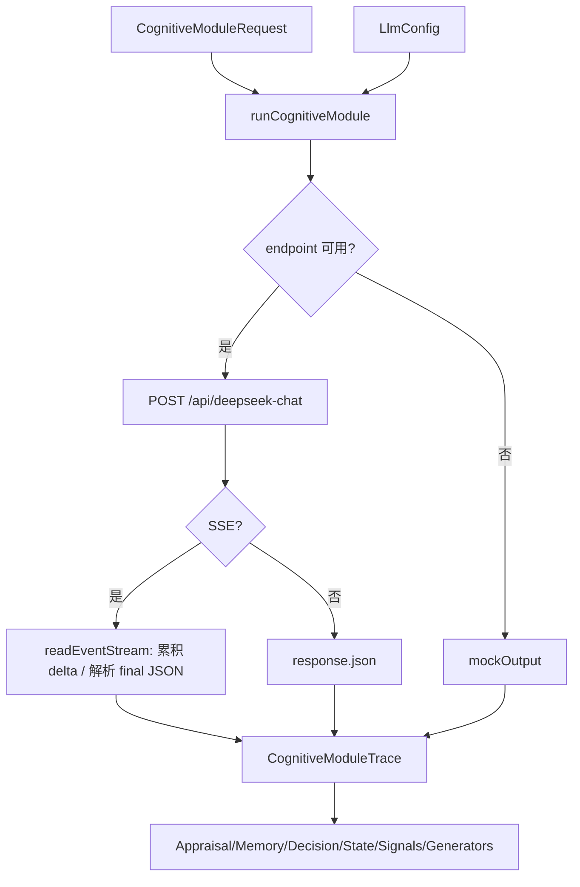
```mermaid
flowchart TD
    REQ["CognitiveModuleRequest"] --> CLIENT["runCognitiveModule"]
    CFG["LlmConfig"] --> CLIENT
    CLIENT --> CHECK{"endpoint 可用?"}
    CHECK -- "是" --> FETCH["POST /api/deepseek-chat"]
    FETCH --> STREAM{"SSE?"}
    STREAM -- "是" --> READ["readEventStream: 累积 delta / 解析 final JSON"]
    STREAM -- "否" --> JSON["response.json"]
    CHECK -- "否" --> MOCK["mockOutput"]
    READ --> TRACE["CognitiveModuleTrace"]
    JSON --> TRACE
    MOCK --> TRACE
    TRACE --> CALLER["Appraisal/Memory/Decision/State/Signals/Generators"]
```

### Appraisal

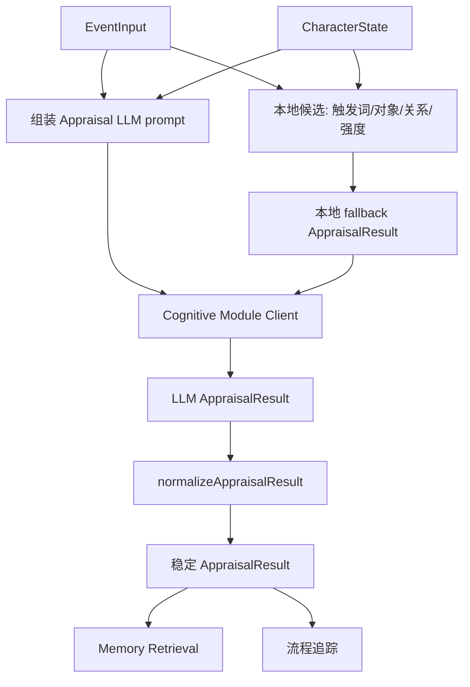
```mermaid
flowchart TD
    E["EventInput"] --> LOCAL["本地候选: 触发词/对象/关系/强度"]
    S["CharacterState"] --> LOCAL
    LOCAL --> MOCK["本地 fallback AppraisalResult"]
    E --> PROMPT["组装 Appraisal LLM prompt"]
    S --> PROMPT
    PROMPT --> CLIENT["Cognitive Module Client"]
    MOCK --> CLIENT
    CLIENT --> RAW["LLM AppraisalResult"]
    RAW --> NORM["normalizeAppraisalResult"]
    NORM --> OUT["稳定 AppraisalResult"]
    OUT --> MEM["Memory Retrieval"]
    OUT --> TRACE["流程追踪"]
```

### Memory Retrieval

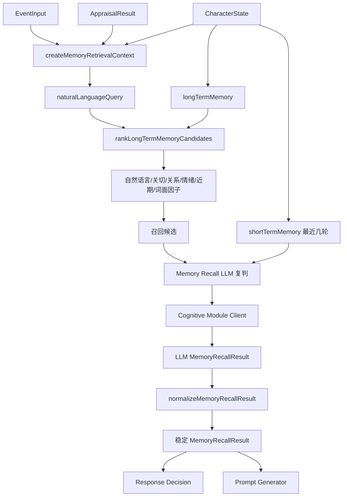
```mermaid
flowchart TD
    E["EventInput"] --> CTX["createMemoryRetrievalContext"]
    A["AppraisalResult"] --> CTX
    S["CharacterState"] --> CTX
    CTX --> QUERY["naturalLanguageQuery"]
    S --> LTM["longTermMemory"]
    QUERY --> RANK["rankLongTermMemoryCandidates"]
    LTM --> RANK
    RANK --> FACTORS["自然语言/关切/关系/情绪/近期/词面因子"]
    FACTORS --> CAND["召回候选"]
    CAND --> PROMPT["Memory Recall LLM 复判"]
    S --> STM["shortTermMemory 最近几轮"]
    STM --> PROMPT
    PROMPT --> CLIENT["Cognitive Module Client"]
    CLIENT --> RAW["LLM MemoryRecallResult"]
    RAW --> NORM["normalizeMemoryRecallResult"]
    NORM --> OUT["稳定 MemoryRecallResult"]
    OUT --> DECISION["Response Decision"]
    OUT --> PROMPTGEN["Prompt Generator"]
```

### Response Decision

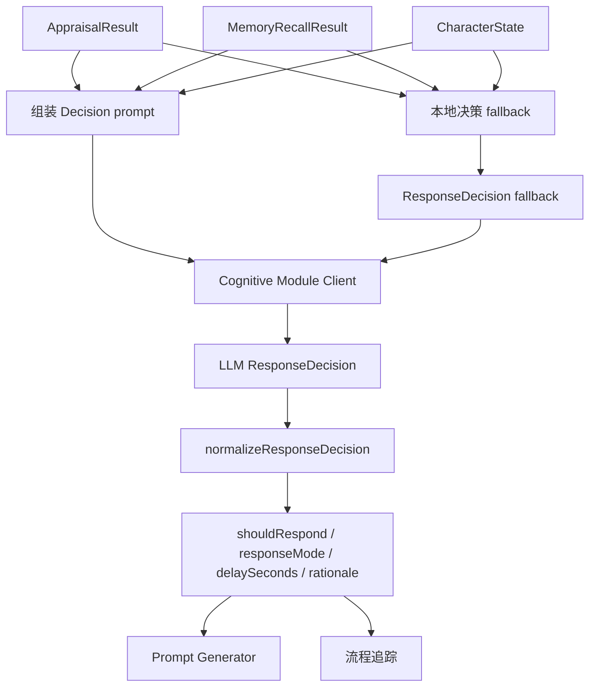
```mermaid
flowchart TD
    A["AppraisalResult"] --> RULES["本地决策 fallback"]
    M["MemoryRecallResult"] --> RULES
    S["CharacterState"] --> RULES
    RULES --> MOCK["ResponseDecision fallback"]
    A --> PROMPT["组装 Decision prompt"]
    M --> PROMPT
    S --> PROMPT
    PROMPT --> CLIENT["Cognitive Module Client"]
    MOCK --> CLIENT
    CLIENT --> RAW["LLM ResponseDecision"]
    RAW --> NORM["normalizeResponseDecision"]
    NORM --> OUT["shouldRespond / responseMode / delaySeconds / rationale"]
    OUT --> PROMPTGEN["Prompt Generator"]
    OUT --> TRACE["流程追踪"]
```

### Prompt Generator

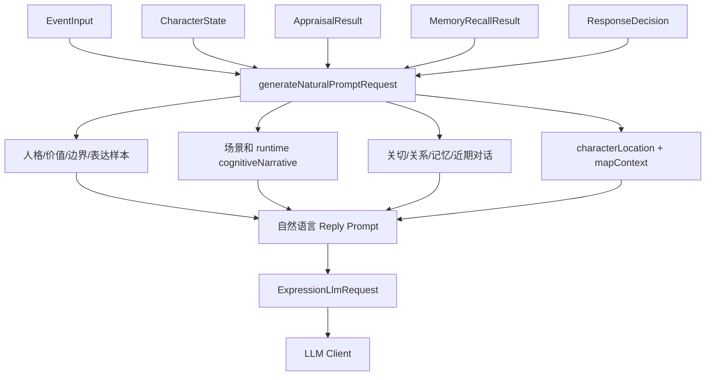
```mermaid
flowchart TD
    E["EventInput"] --> PG["generateNaturalPromptRequest"]
    S["CharacterState"] --> PG
    A["AppraisalResult"] --> PG
    M["MemoryRecallResult"] --> PG
    D["ResponseDecision"] --> PG
    PG --> P1["人格/价值/边界/表达样本"]
    PG --> P2["场景和 runtime cognitiveNarrative"]
    PG --> P3["关切/关系/记忆/近期对话"]
    PG --> P4["characterLocation + mapContext"]
    P1 --> PROMPT["自然语言 Reply Prompt"]
    P2 --> PROMPT
    P3 --> PROMPT
    P4 --> PROMPT
    PROMPT --> REQ["ExpressionLlmRequest"]
    REQ --> LLM["LLM Client"]
```

### LLM Client

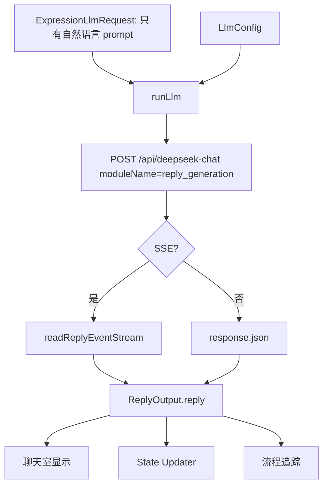
```mermaid
flowchart TD
    REQ["ExpressionLlmRequest: 只有自然语言 prompt"] --> CLIENT["runLlm"]
    CFG["LlmConfig"] --> CLIENT
    CLIENT --> FETCH["POST /api/deepseek-chat moduleName=reply_generation"]
    FETCH --> STREAM{"SSE?"}
    STREAM -- "是" --> READ["readReplyEventStream"]
    STREAM -- "否" --> JSON["response.json"]
    READ --> OUT["ReplyOutput.reply"]
    JSON --> OUT
    OUT --> CHAT["聊天室显示"]
    OUT --> STATE["State Updater"]
    OUT --> TRACE["流程追踪"]
```

### State Updater

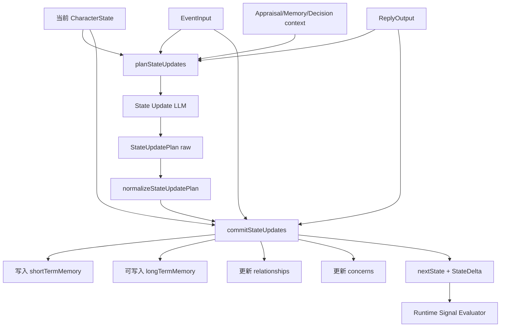
```mermaid
flowchart TD
    S["当前 CharacterState"] --> PLAN["planStateUpdates"]
    E["EventInput"] --> PLAN
    R["ReplyOutput"] --> PLAN
    C["Appraisal/Memory/Decision context"] --> PLAN
    PLAN --> CLIENT["State Update LLM"]
    CLIENT --> RAW["StateUpdatePlan raw"]
    RAW --> NORM["normalizeStateUpdatePlan"]
    NORM --> COMMIT["commitStateUpdates"]
    S --> COMMIT
    E --> COMMIT
    R --> COMMIT
    COMMIT --> STM["写入 shortTermMemory"]
    COMMIT --> LTM["可写入 longTermMemory"]
    COMMIT --> REL["更新 relationships"]
    COMMIT --> CONCERN["更新 concerns"]
    COMMIT --> NEXT["nextState + StateDelta"]
    NEXT --> SIGNAL["Runtime Signal Evaluator"]
```

### Runtime Signal Evaluator

```mermaid
flowchart TD
    S["State after State Update"] --> EVAL["evaluateRuntimeSignals"]
    E["EventInput"] --> EVAL
    R["ReplyOutput"] --> EVAL
    C["Appraisal/Memory/Decision/StateUpdatePlan"] --> EVAL
    EVAL --> CLIENT["Runtime Signal Evaluation LLM"]
    CLIENT --> RAW["RuntimeSignalEvaluationResult raw"]
    RAW --> NORM["normalizeRuntimeSignalEvaluation"]
    NORM --> APPLY["applyRuntimeSignalEvaluation"]
    APPLY --> ENERGY["runtime.energy"]
    APPLY --> MOOD["runtime.derivedMood"]
    APPLY --> PROFILES["runtime.signalProfiles"]
    APPLY --> DELTA["追加 runtimeChanges"]
    DELTA --> FINAL["最终 nextState + StateDelta"]
```

### Conversation Pipeline

```mermaid
flowchart TD
    INPUT["用户消息 content"] --> EVENT["构造 EventInput"]
    EVENT --> PROGRESS1["emit event progress"]
    EVENT --> APPRAISAL["runAppraisal"]
    APPRAISAL --> MEM["retrieveMemory"]
    MEM --> DECISION["decideResponse"]
    DECISION --> PROMPT["generateNaturalPromptRequest"]
    PROMPT --> REPLY["runLlm"]
    REPLY --> UPDATE["applyStateUpdates"]
    UPDATE --> SIGNAL["evaluateRuntimeSignals"]
    SIGNAL --> APPLY["applyRuntimeSignalEvaluation"]
    APPLY --> RETURN["返回 nextState + PipelineTrace"]
    PROGRESS1 --> TRACE["onProgress liveTrace"]
    APPRAISAL --> TRACE
    MEM --> TRACE
    DECISION --> TRACE
    REPLY --> TRACE
    UPDATE --> TRACE
    SIGNAL --> TRACE
```

### Generators

```mermaid
flowchart TD
    INPUT["用户人物/场景素材"] --> TYPE{"生成类型"}
    TYPE -- "人物档案" --> DOSSIER["generateDossierFromDescription"]
    TYPE -- "场景" --> SCENE["generateSceneFromDescription"]
    DOSSIER --> D_LLM["Dossier Interpretation LLM"]
    SCENE --> S_LLM["Scene Interpretation LLM"]
    D_LLM --> D_APPLY["applyDossierInterpretation"]
    S_LLM --> S_APPLY["applySceneInterpretation"]
    D_APPLY --> D_NORM["归一化 profile/concerns/memory/runtime"]
    S_APPLY --> S_NORM["归一化 scene/concerns/memory/runtime/profile影响"]
    D_NORM --> PREVIEW["CharacterState preview"]
    S_NORM --> PREVIEW
    PREVIEW --> CONSISTENCY["Profile Scene Consistency"]
    PREVIEW --> UI["左侧预览卡片"]
```

### Profile Scene Consistency

```mermaid
flowchart TD
    CAND["候选 CharacterState"] --> FALLBACK["本地硬冲突 fallback"]
    CAND --> PROMPT["人物 + 场景一致性 prompt"]
    PROMPT --> CLIENT["Profile Scene Consistency LLM"]
    FALLBACK --> CLIENT
    CLIENT --> RAW["ProfileSceneConsistencyResult raw"]
    RAW --> NORM["normalizeProfileSceneConsistency"]
    NORM --> GATE{"requiresDistortionPassword?"}
    GATE -- "否" --> APPLY["应用候选状态"]
    GATE -- "是" --> PASSWORD["打开扭曲时空密码门禁"]
    PASSWORD --> APPLY
    NORM --> TRACE["系统消息/一致性说明"]
```

### DeepSeek Local Proxy

```mermaid
flowchart TD
    BROWSER["浏览器请求"] --> ROUTE{"API 路由"}
    ROUTE -- "GET /api/deepseek-config" --> READCFG["读取 .deepseek.local.json 或环境变量状态"]
    ROUTE -- "POST /api/deepseek-config" --> ADMIN{"管理员会话?"}
    ADMIN -- "否" --> DENY["401/403"]
    ADMIN -- "是" --> WRITECFG["保存本地密钥文件"]
    ROUTE -- "POST /api/deepseek-chat" --> SESSION{"登录会话?"}
    SESSION -- "否" --> DENY
    SESSION -- "是" --> NORMALIZE["normalizeDeepseekModel"]
    NORMALIZE --> BODY["组装 Chat Completions body"]
    BODY --> THINKING["强制 thinking.disabled"]
    THINKING --> DEEPSEEK["DeepSeek API"]
    DEEPSEEK --> STREAM{"stream=true?"}
    STREAM -- "是" --> SSE["streamDeepseek 转发 text/event-stream"]
    STREAM -- "否" --> JSON["返回 JSON"]
    READCFG --> RESP["响应前端"]
    WRITECFG --> RESP
    SSE --> RESP
    JSON --> RESP
```

### Server Support

```mermaid
flowchart TD
    REQ["认证/档案/审计 API request"] --> SUPPORT["serverSupport.mjs"]
    SUPPORT --> LIAO["liaoChatroom /api/login"]
    SUPPORT --> SESS["内存 authSession"]
    SUPPORT --> BUILTIN["builtinPersonaDossiers.mjs"]
    SUPPORT --> DOS[".persona-dossiers.local.json"]
    SUPPORT --> AUD[".conversation-audits.local.json"]
    LIAO --> SESS
    SESS --> PERM["requireSession / requireAdminSession"]
    BUILTIN --> MERGE["readPersonaDossiers 合并内置和运行时档案"]
    PERM --> DOS
    PERM --> AUD
    DOS --> MERGE
    MERGE --> APP["App Shell 全局档案"]
    AUD --> ADMINUI["管理员审计 UI"]
```

### Production Server

```mermaid
flowchart TD
    REQ["生产 HTTP request"] --> SERVER["server.mjs"]
    SERVER --> ROUTE{"路径类型"}
    ROUTE -- "/health" --> HEALTH["返回 OK"]
    ROUTE -- "/api/auth/*" --> AUTH["Server Support: liao 登录 + 本地会话"]
    ROUTE -- "/api/persona-dossiers" --> DOS["Server Support: 共享档案读写"]
    ROUTE -- "/api/conversation-audits" --> AUD["Server Support: 输入输出审计"]
    ROUTE -- "/api/deepseek-config" --> CFG["读取/写入 .deepseek.local.json"]
    ROUTE -- "/api/deepseek-chat" --> DS["代理 DeepSeek API"]
    ROUTE -- "静态资源" --> STATIC["serveStatic dist 文件"]
    ROUTE -- "SPA fallback" --> HTML["返回 dist/index.html"]
    CFG --> RESP["HTTP response"]
    AUTH --> RESP
    DOS --> RESP
    AUD --> RESP
    DS --> RESP
    STATIC --> RESP
    HTML --> RESP
    HEALTH --> RESP
```

### Manual VPS Update

```mermaid
flowchart TD
    UI["左上角版本区域"] --> STATUS["GET /api/app-update/status"]
    STATUS --> DIFF{"currentCommit != remoteCommit?"}
    DIFF -- "否" --> OK["显示已是最新"]
    DIFF -- "是" --> BADGE["显示有新版本"]
    BADGE --> ADMIN{"当前用户是管理员?"}
    ADMIN -- "否" --> READONLY["只显示状态"]
    ADMIN -- "是" --> RUN["POST /api/app-update/run"]
    RUN --> AUTH["requireAdminSession"]
    AUTH --> GIT["git fetch + git pull --ff-only"]
    GIT --> INSTALL["npm ci"]
    INSTALL --> BUILD["npm run build"]
    BUILD --> RESTART["PM2/自定义命令重启"]
    RUN -. "SSE 日志/进度" .-> UI
```

### Deployment Automation Runbook

```mermaid
flowchart TD
    DOC["docs/DEPLOYMENT_AUTOMATION.md"] --> USER["用户/AI 查看部署说明"]
    USER --> TRIGGER["确认站内管理员触发"]
    USER --> ENVS["确认 APP_UPDATE_* 环境变量"]
    USER --> BOUNDARY["确认 VPS git 工作树和 PM2 边界"]
    USER --> ROLLBACK["查看回滚方法"]
    TRIGGER --> DEPLOY["Manual VPS Update"]
    ENVS --> DEPLOY
    BOUNDARY --> DEPLOY
    ROLLBACK --> INCIDENT["部署失败或需要回滚时使用"]
```

## 当前 UI 结构

```mermaid
flowchart LR
    TOP[左上角版本/GitHub 链接 + 更新状态 + 登录状态] --> LEFT
    LEFT[左侧分组档案/状态/位置/人物档案/场景] --> PIPE[对话流程]
    CHAT[中间对话] --> PIPE
    PIPE --> TRACE[右侧流程追踪]
    TRACE --> JSON[事件/评估/记忆/决策/回应提示词/回应输出/状态更新/信号评估/状态变化]
    TRACE --> AUDIT[管理员输入输出审计]
    TOP --> LOGIN[登录浮窗]
    TOP --> UPDATE[服务器更新浮窗]
    LEFT --> DOS[多人档案: 分组/新建/切换/删除]
    LEFT --> GEN1[生成人物档案]
    LEFT --> GEN2[生成场景]
    GEN1 --> FIT[人物场景一致性检测]
    GEN2 --> FIT
```

左上角版本信息由 App Shell 读取 `package.json` 的 `version` 生成 `appVersionLabel`，并链接到 GitHub 仓库 `<owner>/<repo>`。同一区域会定期调用 `/api/app-update/status` 检查 VPS 当前提交与远端提交是否一致；如果发现新版本，普通用户只看到提示，管理员可以打开更新浮窗触发 `/api/app-update/run`。更新浮窗显示进度条和服务端命令日志。

## 待确认 MVP 架构问题

开始写业务代码前，需要确认以下信息：

1. MVP 第一版要让用户看到什么可运行结果？
2. 虚拟人的核心能力是什么：对话、记忆、情绪、任务执行、声音、形象，还是其中一部分？
3. 第一版是否需要登录系统？
4. 第一版数据是否需要长期保存？
5. 是否必须接入大模型 API？如果是，使用哪个供应商？
6. 是否已有 UI 草图、流程图或前一段对话内容？
7. GitHub 仓库名称和可见性是什么？

## 当前外部资源

| 资源 | 状态 | 说明 |
| --- | --- | --- |
| liao 聊天室用户源 | known | 可读取公开前端脚本确认 `/api/login` 返回 token/user/isAdmin；本项目只用它校验登录，不修改聊天室数据 |
| GitHub 账号 | known | 用户主页为 `<github-owner>` |
| GitHub 仓库 | known | `<owner>/<repo>`，`main` 分支 push 只同步代码，不自动部署 |
| VPS | known | 仅允许后续部署 `<production-domain>` 对应内容 |
| 域名 | known | `<production-domain>` |
| 国内地图服务 | pending | 尚未选型和接入；当前位置字段来自种子或人工维护 |

## 当前模块状态

| 模块 | 状态 | 说明 |
| --- | --- | --- |
| 开发方法 | initialized | 已建立规则文档 |
| 命名登记 | initialized | 已建立 AI 用命名表 |
| 系统流程 | initialized | 已建立初始工作流图 |
| MVP 业务模块 | initialized | 已实现本地可运行的三栏工作台 |
| 多人档案 | initialized | 左侧可按 `personaDossierGroup` 分组、新建、切换、删除 `personaDossier`；每个档案绑定人物状态、配套场景素材和位置属性 |
| 内置人物档案 | initialized | `builtinPersonaDossiers.mjs` 提供 7 个“马可福音10”和 7 个“郑州市”全局初始档案 |
| 人物位置属性 | initialized | `CharacterState.location` 支持当前位置、速度、方向、周边道路/地点/建筑和环境摘要；当前来自 seed/manual |
| 登录机制 | initialized | 用户来自 `LIAO_CHATROOM_ORIGIN` 配置的聊天室登录接口；未登录可看界面但操作会弹登录浮窗 |
| 权限控制 | initialized | `isAdmin` 用户可维护共享档案和查看审计；普通登录用户只可选择共享档案并对话 |
| 共享多人档案 | initialized | 管理员保存到 `.persona-dossiers.local.json`，所有登录用户可读取和使用 |
| 输入输出审计 | initialized | 登录用户对话后写入 `.conversation-audits.local.json`，仅管理员可查看、删除单条或清空 |
| 人物档案生成 | initialized | 通过 Dossier Interpretation LLM 重新解读用户素材，生成 profile、concerns、longTermMemory 和 runtime 预览 |
| 人物档案预览 | initialized | 左侧只展示 `profile.displaySummary` 等摘要信息，用户确认后应用 |
| 场景生成 | initialized | 通过 Scene Interpretation LLM 重新解读用户素材，生成 scene、状态影响、人物影响、关切和记忆预览 |
| 场景预览 | initialized | 先显示场景摘要和状态影响预览，用户确认后应用完整状态 |
| 人物场景一致性检测 | initialized | Profile Scene Consistency LLM 判断人物和场景是否硬冲突；硬冲突需要扭曲时空密码继续 |
| 同步对话路径 | initialized | 事件 -> 评估 -> 记忆召回 -> 回应决策 -> 回应提示词 -> 回应输出 -> 状态更新 -> 信号评估 -> 状态变化 |
| 真实 LLM 接入 | initialized | 当前固定使用本地 DeepSeek 代理、`deepseek-v4-flash`、根目录密钥文件、关闭思考模式和流式输出；UI 不提供模拟语言模型 |
| 流程追踪输入输出 | initialized | 每个模块都有输入、输出、状态；执行时自动切换当前模块 |
| 生产部署 | initialized | `<production-domain>` 通过 nginx 反代 PM2 进程 `<production-pm2-name>`，线上目录 `<production-app-dir>` |
| 站内手动更新 | initialized | 左上角自动检查远端版本；管理员可触发 VPS git pull、npm ci、npm run build 和重启 |
| 国内地图服务 | pending | 尚未接入真实地图商；当前位置和地图上下文不能声称来自地图 API |
| 异步生命路径 | pending | Memory Consolidation、Concern Decay、Internal Monologue、Proactive Scheduler 尚未实现；记忆召回上下文已预留 `async_life` 来源 |

## 部署记录

| 时间 | 提交/版本 | 域名 | 目录 | 进程 | 备份 | 验证 |
| --- | --- | --- | --- | --- | --- | --- |
| 2026-06-01 | `2a4b378` 后续生产服务补丁 | `<production-url>` | `<production-app-dir>` | PM2 `<production-pm2-name>` | `<production-backup-dir>/20260601103603` | HTTPS 首页、`/api/deepseek-config`、DeepSeek SSE、浏览器完整对话链路通过 |
| 2026-06-01 | `2e15c71` LLM 解读人物和场景预览 | `<production-url>` | `<production-app-dir>` | PM2 `<production-pm2-name>` | `<production-backup-dir>/20260601153353` | 本地 build 通过；PM2 online；公网 HTTPS 首页和 `/api/deepseek-config` 通过；浏览器加载新摘要和预览按钮且无 console error |
| 2026-06-02 | `cff06e4` 多人档案、人物场景一致性和生产健康检查 | `<production-url>` | `<production-app-dir>` | PM2 `<production-pm2-name>` | `<production-backup-dir>/20260601160930` | 本地 build 通过；PM2 online；公网 `/health` 返回 OK；公网 `/api/deepseek-config` 返回 DeepSeek 已保存；Playwright 看到多人档案、预览人物档案、预览场景且无 console error |
| 2026-06-02 | `62e0dda` GitHub Actions 自动部署触发优化 | `<production-url>` | `<production-app-dir>` | PM2 `<production-pm2-name>` | `<production-backup-dir>/20260602035631.tgz` | GitHub Actions run #3 success；公网 `/health` 返回 OK；PM2 `<production-pm2-name>` online |
