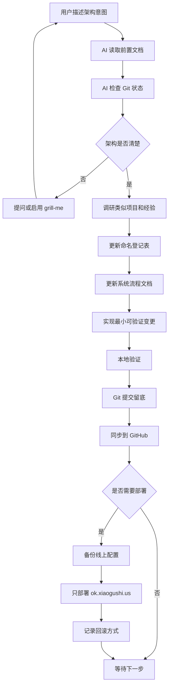
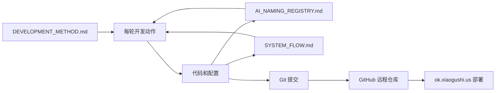

# System Flow

本文档说明系统如何运作、数据如何流动、模块之间如何调用。它既给用户看，也给 AI 后续开发使用。

## 当前阶段

当前只建立开发方法、文档骨架和版本回溯机制。MVP 的具体业务模块尚未确认，因此不提前假设系统结构。

## 总体工作流

## 文档和代码关系

## 待确认 MVP 架构问题

开始写业务代码前，需要确认以下信息：

1. MVP 第一版要让用户看到什么可运行结果？
2. 虚拟人的核心能力是什么：对话、记忆、情绪、任务执行、声音、形象，还是其中一部分？
3. 第一版是否需要登录系统？
4. 第一版数据是否需要长期保存？
5. 是否必须接入大模型 API？如果是，使用哪个供应商？
6. 是否已有 UI 草图、流程图或前一段对话内容？
7. GitHub 仓库名称和可见性是什么？

## 当前外部资源

| 资源 | 状态 | 说明 |
| --- | --- | --- |
| 前置对话链接 | blocked | 链接打开后需要登录，AI 无法读取实际内容 |
| GitHub 账号 | known | 用户主页为 `ttmanthatman`，仓库名未确认 |
| VPS | known | 仅允许后续部署 `ok.xiaogushi.us` 对应内容 |
| 域名 | known | `ok.xiaogushi.us` |

## 当前模块状态

| 模块 | 状态 | 说明 |
| --- | --- | --- |
| 开发方法 | initialized | 已建立规则文档 |
| 命名登记 | initialized | 已建立 AI 用命名表 |
| 系统流程 | initialized | 已建立初始工作流图 |
| MVP 业务模块 | pending | 等待用户补充前置对话或确认第一版目标 |
