# System Flow

本文档说明系统如何运作、数据如何流动、模块之间如何调用。它既给用户看，也给 AI 后续开发使用。

## 当前阶段

当前已建立第一版本地 MVP：三栏工作台展示分组多人档案、人物状态、当前位置、聊天室、流程追踪和生成监视。系统能根据用户素材预览人物档案和配套场景，并在发送消息后展示多模块 LLM 数据流。

开发工作流已改为模块上下文包模式。每轮先读轻量启动文档、错误精髓摘要和 `docs/modules/<module>.md`，再用 `rg` 从 `docs/AI_NAMING_REGISTRY.md` 与本文档中抽取本模块相关片段。只有跨模块协作、权限边界、数据流、部署路径或广域架构变化时，才全量阅读并更新本文档。

当前系统已接入登录和权限边界。未登录用户可以看到完整工作台界面，但发送消息、切换档案、生成或应用档案、保存 DeepSeek 密钥、测试 DeepSeek、查看审计等操作会打开登录浮窗。登录账号来自 `LIAO_CHATROOM_ORIGIN` 配置的聊天室用户；本项目只调用 liao 聊天室 `/api/login` 校验用户名和密码，不保存密码，不修改聊天室数据。

管理员权限沿用 liao 聊天室登录结果里的 `isAdmin`。只有管理员可以新增、保存、删除或应用共享多人档案，也可以修改档案分组；普通登录用户可以读取、选择和使用管理员保存的共享档案。用户对话时产生的中间栏消息仍按 `userId + dossierId` 写入：前端默认“我的历史”通过 `/api/persona-dossiers/:id/conversation-history` 加载当前用户消息，发送后也只写入当前用户消息桶。当前角色下的用户历史还会通过 `/api/conversation-histories` 以只读方式列出和读取，任一登录用户都可以查看其他用户与该角色的历史。服务端角色运行态通过 `/api/persona-dossiers/:id/conversation-state` 按 `dossierId` 写入 `.conversation-states.local.json` 的全局角色条目；短期记忆、长期记忆、runtime 状态、关系变化、对各用户的关系印象、scene 和 location 都由同一个人物共享，不覆盖 `.persona-dossiers.local.json` 中的共享底稿。

系统启动时会合并 `builtinPersonaDossiers.mjs` 中的内置全局档案和 `.persona-dossiers.local.json` 中管理员保存的共享档案。当前内置 14 个档案：7 个“马可福音10”人物和 7 个“郑州市”人物；每个档案都包含人物、从小到大的关键经历、心理变化、关系变化、熟人关系、场景、分组和位置属性。管理员删除内置档案时不会改源码，而是在运行时存储里记录 tombstone。

人物档案显示分成预览和详细。详细档案直接来自 `CharacterProfile` 的 `fullLifeStory`、`lifeEvents`、`personalityFacets` 和 `relationships`；预览短文由 DeepSeek 生成，不由源码手写。角色缺少 `personaDossier.previewSummary` 时，UI 显示“预览生成中”并在左侧档案卡显示扫光动画；登录用户打开该角色后，前端调用 DeepSeek 生成短预览，再通过 `/api/persona-dossiers/:id/preview` 全局保存。短预览生成和管理员人物/场景生成使用独立生成状态，不设置聊天 `isRunning`，因此生成过程中仍可发送对话。

后台会记录每个登录用户的一次输入、虚拟人输出和本轮对话的模块调用记录，并在新审计记录里保存本轮 `conversationEventId` 和中间栏消息 ID，作为删除同轮运行态的锚点。审计记录写入 `.conversation-audits.local.json`，中间栏历史写入 `.conversation-histories.local.json`，角色全局对话运行态写入 `.conversation-states.local.json`，共享档案写入 `.persona-dossiers.local.json`；这些都是运行时文件，被 `.gitignore` 忽略。中间栏临时心理流来自 `PipelineStepProgress.mindFlow`，只在当前轮 streaming 展示和折叠，不写入后台历史。只有管理员可以通过 `/api/conversation-audits` 读取、删除单条或清空审计，也可以通过 `/api/conversation-audits/export` 导出所选记录或完整导出所有用户的所有输入输出审计记录；删除审计时会级联清理同轮中间栏消息、短期记忆、长期记忆和关系记忆片段，前端同步清理当前消息桶和 localStorage，避免旧缓存回填。所有登录用户可以通过 `/api/conversation-histories` 按人物只读查看各用户中间栏历史；旧 `/api/admin/conversation-histories` 路由保留兼容但同样只要求登录。管理员还可以通过 `/api/persona-dossiers/:id/reset-conversation` 将当前角色恢复到共享档案底稿，同时清理该角色所有用户历史、全局运行态和对应审计。

重要约束：同步对话链路的主脑是 `roleTurn`。它在一次 LLM 调用里把人物档案、场景、最近对话、关系记忆、长期候选和 runtime narrative 放在同一个上下文中，直接模拟人物心理并产出台词。Appraisal、Memory Recall 和 Decision 在当前同步主路径里只是 `roleTurn` 输出的兼容视图，供 UI、审计、心流帧和 State Update 读取；不能重新变成多次独立 LLM 转述。

认知模块是另一类 LLM 调用。当前同步路径只保留两个会影响对话结果的关键外部 LLM 节点：`roleTurn` 负责说话前的一次完整人物心理-表达回合，State Update 负责说话后的自然语言状态写回判断。历史上的 Appraisal、Memory Recall、Decision 和 Reply Generation 模块文件仍保留，供兼容脚本、未来实验或局部回滚使用，但 Conversation Pipeline 主路径不再逐个调用它们。`roleTurnProbe` 是默认关闭的旁路审计节点；开启时也只在 State Update、Runtime Signal Evaluation 和 `stateDelta` 完成后观察主脑输入输出，不参与台词、状态或记忆。

真实 LLM 的自然语言输出保留为 narrative，并用兼容字段承接旧 UI 和审计。`roleTurn` 输出四段自然语言：心理状态、记忆浮现、开口倾向、说出口；这不是 JSON 或字段表，而是为了把内部摘要与最终台词分离。Cognitive Module Client 仍保留结构化 fallback 能力，供人物/场景生成预览、兼容脚本或未来结构化模块使用。如果外部结构化 JSON 被截断或无法解析，Cognitive Module Client 会记录 `fallbackReason` 并使用本地候选结果继续流程，不能让用户对话卡死。

`roleTurn` 的“说出口”段落要过台词边界归一化：开头括号动作旁白和说话人标签会被剥离，最终写入聊天历史、状态更新和审计的 `ReplyOutput.reply` 只保留角色实际说出口的话。多行台词仍按自然消息分段展示。

Memory Recall 不是敏感词召回。当前同步主路径会把最近 6 小时最多 10 条短期对话、过去 6 小时关系/状态/场景摘要、长期记忆候选和关系记忆候选整理成自然语言清单，直接放进 `roleTurn` 上下文，由同一个 LLM 在人物心理里判断此刻什么会浮现。`memoryRecall` trace 仍保留短期上下文和长期候选，只是由 `roleTurn.memoryNarrative` 派生，不再单独调用 Memory Recall LLM。跨天或其他用户历史不会被描述成“刚才”。未来异步生命路径仍可复用同一套召回上下文，只是 `source` 从 `sync_response` 变成 `async_life`。

左侧 UI 里的 DeepSeek 预览、性格标签、能量、情绪、情绪倾向、唤醒度和当前位置是给人快速观察的摘要。它们由 DeepSeek 预览缓存、State Update 确定性写入的 runtime 展示信号、种子档案或管理员维护字段提供，不由兼容字段直接控制台词。Runtime Signal Evaluation 在同步对话里只保留本地快照和 trace，不再调用外部 LLM 覆盖 State Update 刚写入的 runtime。提交给 `roleTurn` 的是 `fullLifeStory`、`lifeEvents`、`socialPersonaPattern`、`personalitySummary`、`personalityFacets`、`relationships`、`relationshipMemory`、`runtime.signalProfiles.*.cognitiveNarrative`、`scene.cognitiveNarrative`、`characterLocation` 和 `mapContext` 等自然语言综合描述。

对话开始后，系统不再把人物固定在档案初始场景。Conversation Pipeline 会先运行本地 `temporalSceneProgression`：根据 `CharacterState.location` 推断时区，用该地真实当前时间判断人物更可能在工作、通勤、住处、睡眠或临时外出场景，再把 `scene/location` 推进为同一地理范围内的自然现场。同步对话路径不再用用户话语关键词触发移动或瞬移；用户话语对行动意图的影响交给后续 LLM 自然语言模块评价，并由 State Update 决定是否写成关系、状态或长期记忆。routine 仍可继续推进上班、睡眠、通勤和回家，跨城/跨国或世界观不可能的地点不会瞬移。

人物属性、状态信号和场景叙述只描述内部倾向、形成原因、身体感、关系距离和注意力落点，不能写成“回复应如何”“不要如何”“用什么话术”这类直接指令。`roleTurn` 会把这些自然语言材料放进同一个人物心理回合里，让 LLM 直接完成理解和表达；旧 `Prompt Builder` 和 `runExpressionLlm` 仍作为兼容 helper 保留，不再是 Conversation Pipeline 主路径的表达决策环节。

人物档案和场景预览也属于认知模块，不是本地字符串拼接。这里的“预览”指管理员应用前的待应用预览：人物档案预览通过 Dossier Interpretation LLM 将用户素材拆成展示摘要、生平事件、长期记忆、人性/人格、标签、关切和状态信号；场景预览通过 Scene Interpretation LLM 将用户素材拆成场景摘要、状态影响和人物影响。预览应用时写入的是 LLM 解读后的结构化状态，而不是用户原文。左侧人物短预览是另一条 DeepSeek 缓存路径：它只生成 `personaDossier.previewSummary`，不改详细档案。

人物档案和场景设置作为 `personaDossier` 成组保存。左侧可以按 `personaDossierGroup` 分组展示、新建、切换和删除档案；切换档案时人物状态、人物素材、场景素材和位置属性一起切换。应用人物或场景预览前，Profile Scene Consistency LLM 会判断人物与场景是否处于同一世界观、时代和社会语境；现代人物进入古代场景这类硬冲突需要输入本地“扭曲时空密码”才能继续。

DeepSeek 接入必须关闭思考模式。应用固定使用真实 DeepSeek 本地代理和 `deepseek-v4-flash`，不再暴露模拟语言模型选项。代理层对所有 DeepSeek Chat Completions 请求显式传入 `thinking: { type: "disabled" }`，不发送 `reasoning_effort`，并把 `deepseek-reasoner` 纠正为 `deepseek-v4-flash`。

流程追踪面板不是事后 dump。每个模块开始时会自动切换到当前步骤，并显示该模块的输入、流式输出和状态。右侧面板分为对话流程和生成监视两组，生成监视覆盖人物短预览、人物档案生成和场景生成。每个步骤都必须让用户能分清“发给模块的输入”和“模块返回的输出”。

## 总体工作流

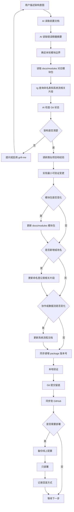

## 文档和代码关系

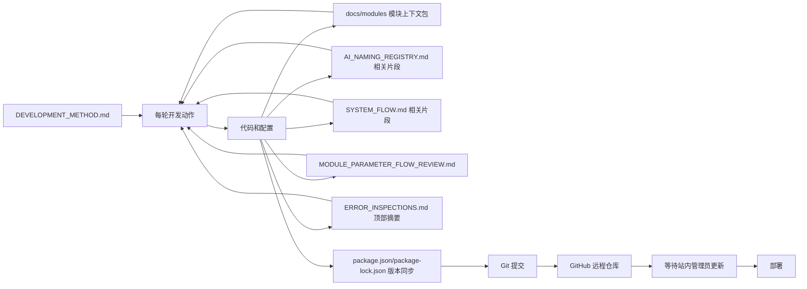

`docs/MODULE_PARAMETER_FLOW_REVIEW.md` 是参数级人工审核清单：它逐项列出共享数据对象字段、模块入参/输出、内部派生参数和跨模块流向。`docs/SYSTEM_FLOW.md` 继续负责系统协作图和架构叙述；当模块参数或模块间数据流变化时，两个文件应同步更新。

## 生产部署路径

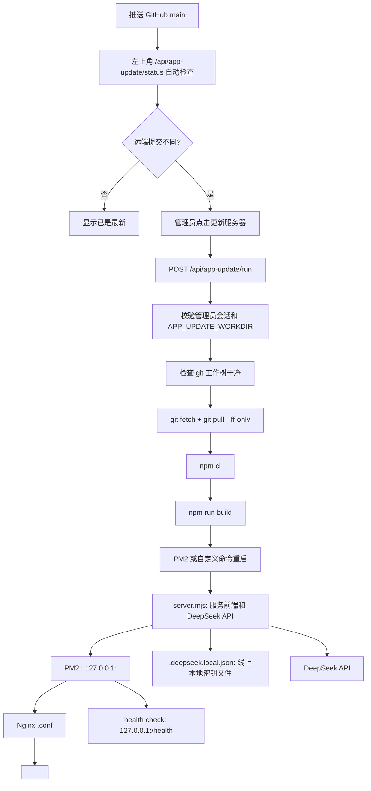

生产不再由 GitHub Actions push 自动部署。服务器通过 `APP_UPDATE_WORKDIR` 指向 VPS 上的 git clone 工作树，左上角自动检查远端分支是否有新提交；只有管理员可以触发 `/api/app-update/run`。更新过程会在站内窗口显示步骤、stdout/stderr 和进度。`LIAO_CHATROOM_ORIGIN`、`APP_UPDATE_WORKDIR`、`APP_UPDATE_PM2_NAME` 或 `APP_UPDATE_RESTART_COMMAND` 等生产环境变量留在 VPS，不写入仓库。

## 当前 MVP 同步响应路径

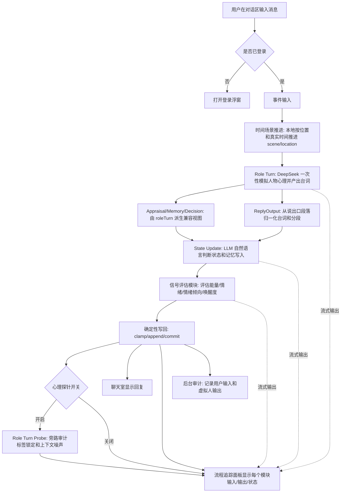

## 登录与权限路径

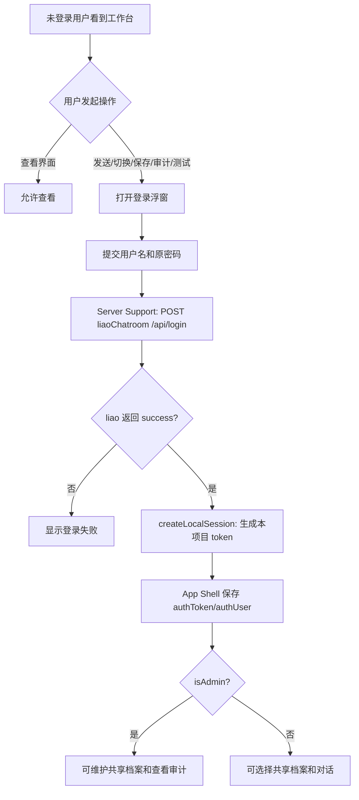

本项目的本地 `authSession` 存在内存中，服务重启后需要重新登录。上游 liao token 不返回前端，也不写入仓库；用户密码只在登录请求中转发给 `LIAO_CHATROOM_ORIGIN` 配置的 liao 聊天室校验。

## 记忆召回路径

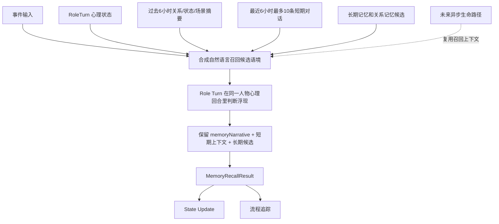

本地候选层只负责把可读材料整理好，不做最终心理判断。它的责任是避免把整个历史粗暴塞给模型，同时避免只按敏感词命中决定召回。当前同步主路径由 `roleTurn` 在同一个人物心理回合里说明“没有词面命中但语义相关”的记忆为什么浮现，也可以说明“只是撞词但语义无关”的候选为什么不该影响当下。

## 生成预览路径

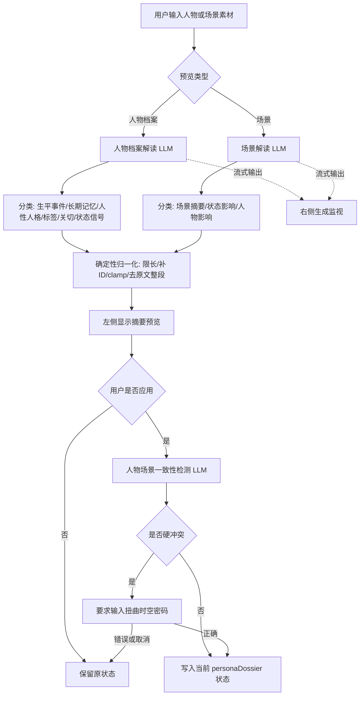

## 人物短预览缓存路径

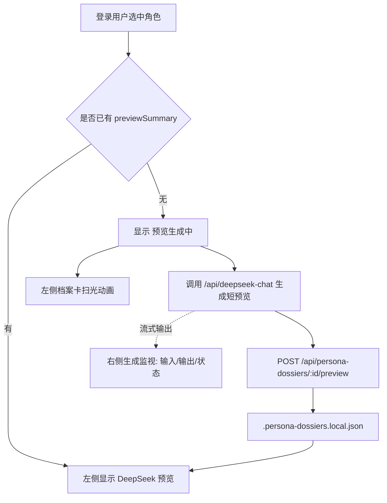

## 多人档案路径

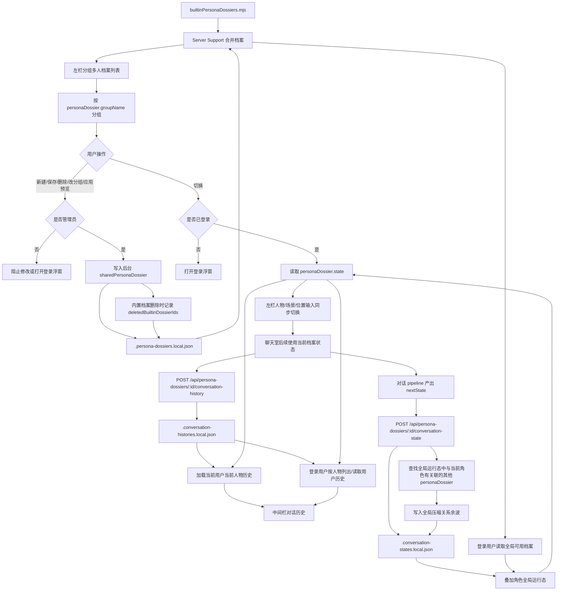

内置档案和管理员保存的多人档案都是全局可用共享底稿。普通用户选择它之后可以对话使用；中间栏消息会保存到 `.conversation-histories.local.json` 中当前 `userId + dossierId` 条目，切换人物时重新读取。登录用户历史以服务端返回为准；如果服务端返回空历史，前端必须清空内存消息桶和 localStorage，不能把旧缓存再写回服务器。对话产生的短期记忆、长期记忆、runtime 状态、关系变化、场景和位置会写回 `.conversation-states.local.json` 中当前 `dossierId` 的全局角色条目。同一角色现在全局对应多个用户历史：登录用户默认只写自己的消息桶，也可以通过只读选择器查看其他用户与该角色的中间栏历史；查看其他用户历史时不能发送。所有用户也会读取同一人物的同一份角色记忆和场景状态。为了让熟人关系在角色网络中产生影响，后台把压缩后的关系余波写给全局运行态里相关人物，不把用户原始长对话全文扩散到共享档案底稿。

## 对话审计路径

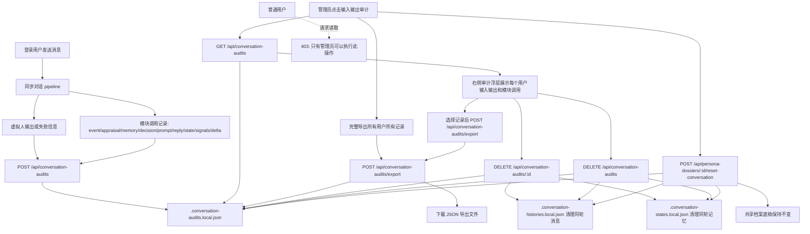

## 生成预览写回边界

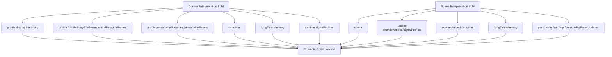

## 模块级流程图

以下流程图按 `docs/AI_NAMING_REGISTRY.md` 的模块登记表逐一展开。每张图只说明该模块自己的输入、内部步骤、输出和主要下游，方便逐个检查边界。

### App Shell

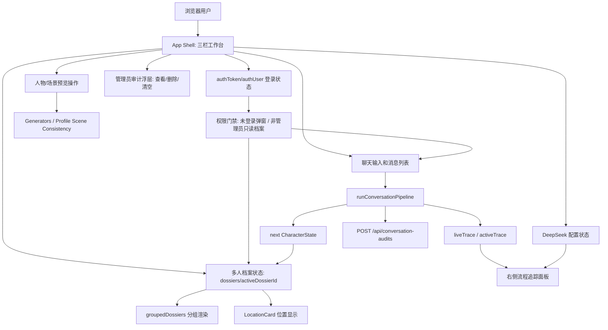

### Core Types

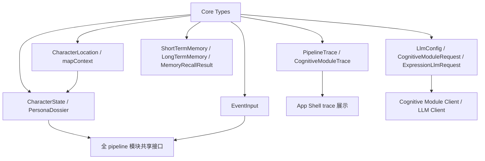

### Seed State

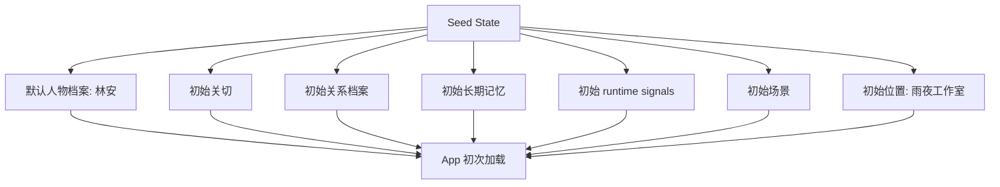

### Cognitive Module Client

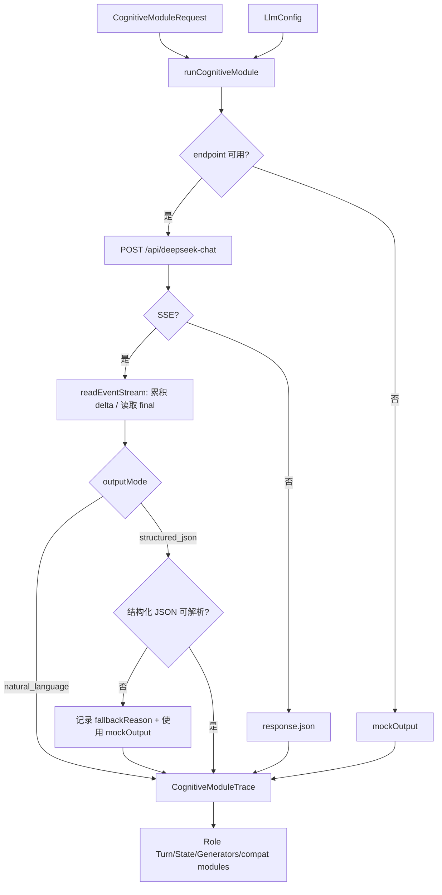

### Role Turn

Role Turn 是同步对话主脑。它不是“先分析再让另一个模型改写”，而是在一次 DeepSeek Flash 调用里读取人物生平、性格面、表达样本、当前场景、位置、runtime narrative、最近 6 小时对话、关系记忆、长期候选和当前用户原话，直接模拟这一刻的人物心理并产出最终聊天台词。输出是四段自然语言：心理状态、记忆浮现、开口倾向、说出口。前三段用于 trace、心流帧和 State Update 上下文；“说出口”段落经本地归一化后成为 `ReplyOutput.reply` 和 `replyOutput.segments`。

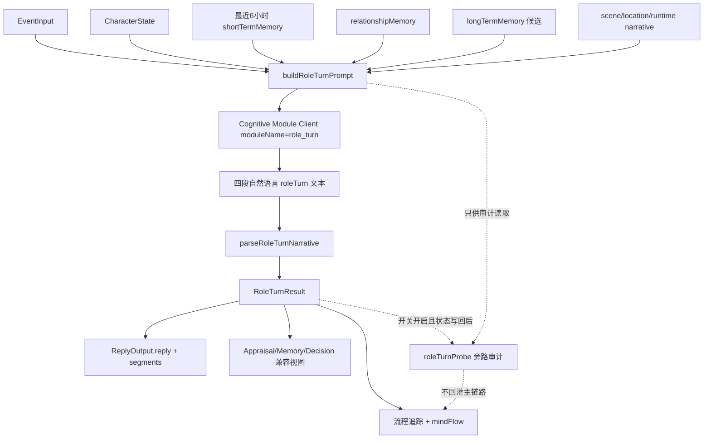

### Appraisal

Appraisal 在当前同步主路径里不是独立 LLM 调用，而是 `roleTurn.innerStateNarrative` 的兼容视图。`AppraisalResult` 仍保留危险、清醒度、回应需要、情绪冲击、失态风险等字段，服务右侧追踪、审计、旧 UI 和 State Update 的兼容输入；语义主干仍是 `roleTurn` 的自然语言心理状态段落。`src/pipeline/appraisal.ts` 的旧独立模块仍保留，供局部实验、验证脚本或回滚使用。

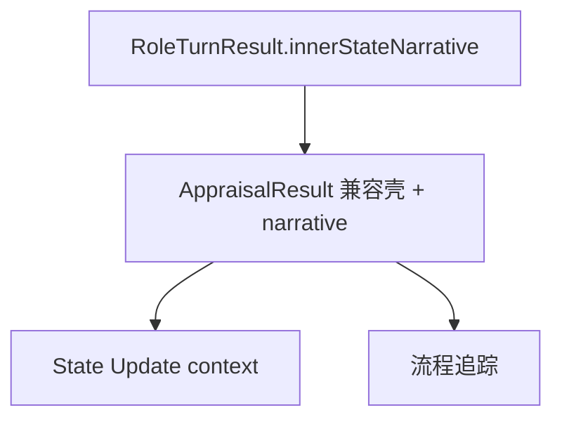

### Memory Retrieval

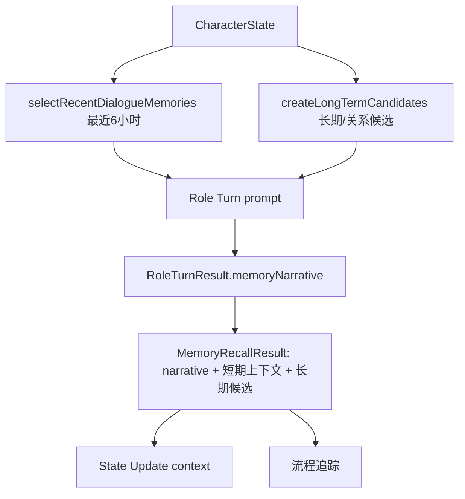

Memory Retrieval 在当前同步主路径里只做本地候选上下文选择，不单独调用 Memory Recall LLM。人物是否真的想起这些内容由 `roleTurn` 在同一个角色心理回合里判断，避免“先让一个模型解释记忆，再让另一个模型转述成台词”的二次稀释。

### Response Decision

Response Decision 在当前同步主路径里由 `roleTurn.decisionNarrative` 和最终台词派生。它保留 `shouldRespond`、`responseMode`、`replyRhythm`、`shouldLoseComposure`、`shouldBreakPersona` 等兼容字段，主要用于 UI、审计和消息分段；不再作为台词生成前的独立外部 LLM 路由。`src/pipeline/responseDecision.ts` 仍保留旧独立模块，供实验和回滚使用。

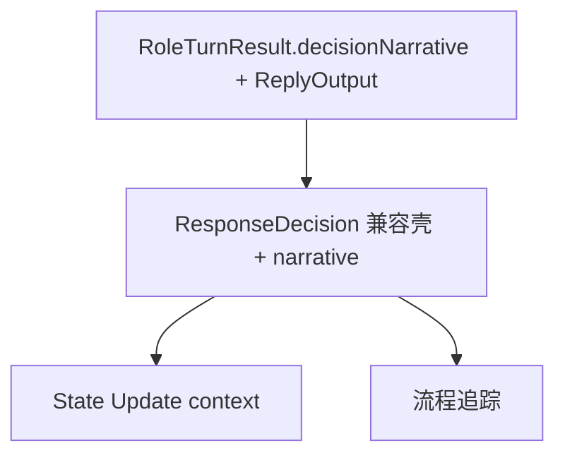

### 统一表达模块

统一表达模块在当前 Conversation Pipeline 主路径里已由 Role Turn 替代。`promptBuilder.ts`、`runExpressionLlm` 和 `runLlm` 仍保留，服务旧验证、局部实验或未来需要单独生成台词的路径；但同步对话不再把 Appraisal/Memory/Decision 的二手叙述再交给 Reply LLM 改写。

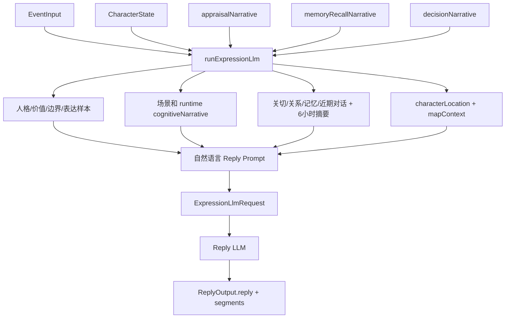

### LLM Client

```mermaid
flowchart TD
    REQ["ExpressionLlmRequest: 只有自然语言 prompt"] --> CLIENT["runLlm"]
    CFG["LlmConfig"] --> CLIENT
    CLIENT --> FETCH["POST /api/deepseek-chat moduleName=reply_generation"]
    FETCH --> STREAM{"SSE?"}
    STREAM -- "是" --> READ["readReplyEventStream"]
    STREAM -- "否" --> JSON["response.json"]
    READ --> OUT["ReplyOutput.reply"]
    JSON --> OUT
    OUT --> SEG["normalize ReplyOutput.segments"]
    SEG --> CHAT["聊天室显示；multi_turn/burst 可分成多条消息"]
    OUT --> STATE["State Updater"]
    OUT --> TRACE["流程追踪"]
```

### State Updater

```mermaid
flowchart TD
    S["当前 CharacterState"] --> PLAN["planStateUpdates"]
    E["EventInput"] --> PLAN
    R["ReplyOutput"] --> PLAN
    C["Appraisal/Memory/Decision narrative"] --> PLAN
    PLAN --> CLIENT["State Update LLM 自然语言出口"]
    CLIENT --> RAW["State update narrative"]
    RAW --> PLAN2["StateUpdatePlan 兼容壳"]
    PLAN2 --> COMMIT["commitStateUpdates"]
    C --> COMMIT
    S --> COMMIT
    E --> COMMIT
    R --> COMMIT
    COMMIT --> STM["写入 shortTermMemory"]
    COMMIT --> LTM["按自然语言状态写回评估写入 longTermMemory"]
    COMMIT --> RMEM["写入/强化 relationshipMemory 关系记忆区"]
    COMMIT --> REL["更新 relationships"]
    COMMIT --> CONCERN["保留 concerns 兼容字段"]
    COMMIT --> RUNTIME["写入 runtime.energy / derivedMood / signalProfiles"]
    COMMIT --> NEXT["nextState + StateDelta"]
    NEXT --> SIGNAL["Runtime Signal Evaluator"]
```

State Update 不再要求 LLM 输出 JSON delta。LLM 用自然语言判断说完后的身体/情绪/注意力余波、当前用户关系印象、哪些内容只留短期、哪些值得成为长期记忆；本地只把这段 narrative 落成兼容运行态、关系记忆和审计 trace。

### Runtime Signal Evaluator

```mermaid
flowchart TD
    S["State after State Update"] --> EVAL["evaluateRuntimeSignals"]
    E["EventInput"] --> EVAL
    R["ReplyOutput"] --> EVAL
    C["StateUpdate narrative"] --> EVAL
    EVAL --> RAW["本地 RuntimeSignalEvaluationResult 快照"]
    RAW --> NORM["normalizeRuntimeSignalEvaluation"]
    NORM --> APPLY["applyRuntimeSignalEvaluation"]
    APPLY --> ENERGY["runtime.energy"]
    APPLY --> MOOD["runtime.derivedMood"]
    APPLY --> PROFILES["runtime.signalProfiles"]
    APPLY --> DELTA["追加 runtimeChanges"]
    DELTA --> FINAL["最终 nextState + StateDelta"]
```

### Conversation Pipeline

```mermaid
flowchart TD
    INPUT["用户消息 content"] --> EVENT["构造 EventInput"]
    EVENT --> PROGRESS1["emit event progress"]
    EVENT --> SCENE["advanceSceneForCurrentTime"]
    SCENE --> ROLE["runRoleTurn"]
    ROLE --> VIEWS["buildAppraisal/Memory/Decision traces"]
    ROLE --> REPLY["ReplyOutput from 说出口段落"]
    REPLY --> UPDATE["applyStateUpdates"]
    VIEWS --> UPDATE
    UPDATE --> SIGNAL["evaluateRuntimeSignals"]
    SIGNAL --> APPLY["applyRuntimeSignalEvaluation"]
    APPLY --> RETURN["返回 nextState + PipelineTrace"]
    SCENE --> MIND["emit pre-speech mindFlow"]
    VIEWS --> MIND
    REPLY --> FOLD["App Shell 折叠 pre-speech 心理流并显示第一句"]
    UPDATE --> POSTMIND["emit post-speech mindFlow"]
    SIGNAL --> POSTMIND
    APPLY --> POSTMIND
    PROGRESS1 --> TRACE["onProgress liveTrace"]
    SCENE --> TRACE
    MIND --> CHAT["中间栏临时心理流"]
    POSTMIND --> CHAT
    FOLD --> CHAT
    ROLE --> TRACE
    VIEWS --> TRACE
    REPLY --> TRACE
    UPDATE --> TRACE
    SIGNAL --> TRACE
```

### Generators

```mermaid
flowchart TD
    INPUT["用户人物/场景素材"] --> TYPE{"生成类型"}
    TYPE -- "人物档案" --> DOSSIER["generateDossierFromDescription"]
    TYPE -- "场景" --> SCENE["generateSceneFromDescription"]
    DOSSIER --> D_LLM["Dossier Interpretation LLM"]
    SCENE --> S_LLM["Scene Interpretation LLM"]
    D_LLM --> D_APPLY["applyDossierInterpretation"]
    S_LLM --> S_APPLY["applySceneInterpretation"]
    D_APPLY --> D_NORM["归一化 profile/concerns/memory/runtime"]
    S_APPLY --> S_NORM["归一化 scene/concerns/memory/runtime/profile影响"]
    D_NORM --> PREVIEW["CharacterState preview"]
    S_NORM --> PREVIEW
    PREVIEW --> CONSISTENCY["Profile Scene Consistency"]
    PREVIEW --> UI["左侧预览卡片"]
```

### Profile Scene Consistency

```mermaid
flowchart TD
    CAND["候选 CharacterState"] --> FALLBACK["本地硬冲突 fallback"]
    CAND --> PROMPT["人物 + 场景一致性 prompt"]
    PROMPT --> CLIENT["Profile Scene Consistency LLM"]
    FALLBACK --> CLIENT
    CLIENT --> RAW["ProfileSceneConsistencyResult raw"]
    RAW --> NORM["normalizeProfileSceneConsistency"]
    NORM --> GATE{"requiresDistortionPassword?"}
    GATE -- "否" --> APPLY["应用候选状态"]
    GATE -- "是" --> PASSWORD["打开扭曲时空密码门禁"]
    PASSWORD --> APPLY
    NORM --> TRACE["系统消息/一致性说明"]
```

### DeepSeek Local Proxy

```mermaid
flowchart TD
    BROWSER["浏览器请求"] --> ROUTE{"API 路由"}
    ROUTE -- "GET /api/deepseek-config" --> READCFG["读取 .deepseek.local.json 或环境变量状态"]
    ROUTE -- "POST /api/deepseek-config" --> ADMIN{"管理员会话?"}
    ADMIN -- "否" --> DENY["401/403"]
    ADMIN -- "是" --> WRITECFG["保存本地密钥文件"]
    ROUTE -- "POST /api/deepseek-chat" --> SESSION{"登录会话?"}
    SESSION -- "否" --> DENY
    SESSION -- "是" --> NORMALIZE["normalizeDeepseekModel"]
    NORMALIZE --> BODY["组装 Chat Completions body"]
    BODY --> THINKING["强制 thinking.disabled"]
    THINKING --> DEEPSEEK["DeepSeek API"]
    DEEPSEEK --> STREAM{"stream=true?"}
    STREAM -- "是" --> SSE["streamDeepseek 转发 text/event-stream"]
    STREAM -- "否" --> JSON["返回 JSON"]
    READCFG --> RESP["响应前端"]
    WRITECFG --> RESP
    SSE --> RESP
    JSON --> RESP
```

### Server Support

```mermaid
flowchart TD
    REQ["认证/档案/审计 API request"] --> SUPPORT["serverSupport.mjs"]
    SUPPORT --> LIAO["liaoChatroom /api/login"]
    SUPPORT --> SESS["内存 authSession"]
    SUPPORT --> BUILTIN["builtinPersonaDossiers.mjs"]
    SUPPORT --> DOS[".persona-dossiers.local.json"]
    SUPPORT --> USTATE[".conversation-states.local.json"]
    SUPPORT --> UHIST[".conversation-histories.local.json"]
    SUPPORT --> AUD[".conversation-audits.local.json"]
    LIAO --> SESS
    SESS --> PERM["requireSession / requireAdminSession"]
    BUILTIN --> MERGE["readPersonaDossiers 合并内置和共享档案"]
    USTATE --> OVERLAY["叠加角色全局运行态"]
    UHIST --> CHATHIST["读取/追加当前用户中间栏历史"]
    UHIST --> ADMINHIST["管理员读取指定人物下用户历史"]
    PERM --> DOS
    PERM --> USTATE
    PERM --> UHIST
    PERM --> AUD
    DOS --> MERGE
    MERGE --> OVERLAY
    OVERLAY --> APP["App Shell 当前用户档案"]
    CHATHIST --> APP
    ADMINHIST --> APP
    AUD --> ADMINUI["管理员审计 UI"]
```

### Production Server

```mermaid
flowchart TD
    REQ["生产 HTTP request"] --> SERVER["server.mjs"]
    SERVER --> ROUTE{"路径类型"}
    ROUTE -- "/health" --> HEALTH["返回 OK"]
    ROUTE -- "/api/auth/*" --> AUTH["Server Support: liao 登录 + 本地会话"]
    ROUTE -- "/api/persona-dossiers" --> DOS["Server Support: 共享档案读写"]
    ROUTE -- "/api/conversation-audits" --> AUD["Server Support: 输入输出审计"]
    ROUTE -- "/api/deepseek-config" --> CFG["读取/写入 .deepseek.local.json"]
    ROUTE -- "/api/deepseek-chat" --> DS["代理 DeepSeek API"]
    ROUTE -- "静态资源" --> STATIC["serveStatic dist 文件"]
    ROUTE -- "SPA fallback" --> HTML["返回 dist/index.html"]
    CFG --> RESP["HTTP response"]
    AUTH --> RESP
    DOS --> RESP
    AUD --> RESP
    DS --> RESP
    STATIC --> RESP
    HTML --> RESP
    HEALTH --> RESP
```

### Manual VPS Update

```mermaid
flowchart TD
    UI["左上角版本区域"] --> STATUS["GET /api/app-update/status"]
    STATUS --> DIFF{"currentCommit != remoteCommit?"}
    DIFF -- "否" --> OK["显示已是最新"]
    DIFF -- "是" --> CHANGES["读取 current..remote 提交摘要"]
    CHANGES --> BADGE["显示有新版本和本次更新"]
    BADGE --> ADMIN{"当前用户是管理员?"}
    ADMIN -- "否" --> READONLY["只显示状态"]
    ADMIN -- "是" --> RUN["POST /api/app-update/run"]
    RUN --> AUTH["requireAdminSession"]
    AUTH --> GIT["git fetch + git pull --ff-only"]
    GIT --> INSTALL["npm ci"]
    INSTALL --> BUILD["npm run build"]
    BUILD --> RESTART["PM2/自定义命令重启"]
    RUN -. "SSE 日志/进度" .-> UI
```

### Deployment Automation Runbook

```mermaid
flowchart TD
    DOC["docs/DEPLOYMENT_AUTOMATION.md"] --> USER["用户/AI 查看部署说明"]
    USER --> TRIGGER["确认站内管理员触发"]
    USER --> ENVS["确认 APP_UPDATE_* 环境变量"]
    USER --> BOUNDARY["确认 VPS git 工作树和 PM2 边界"]
    USER --> ROLLBACK["查看回滚方法"]
    TRIGGER --> DEPLOY["Manual VPS Update"]
    ENVS --> DEPLOY
    BOUNDARY --> DEPLOY
    ROLLBACK --> INCIDENT["部署失败或需要回滚时使用"]
```

## 当前 UI 结构

```mermaid
flowchart LR
    TOP[左上角版本/GitHub 链接 + 更新状态 + 登录状态] --> LEFT
    LEFT[左侧分组档案/状态/位置/人物档案/场景] --> PIPE[对话流程]
    CHAT[中间对话] --> PIPE
    PIPE --> TRACE[右侧流程追踪]
    TRACE --> JSON[事件/评估/记忆/决策/表达整合/回应输出/状态更新/信号评估/状态变化]
    LEFT --> MONITOR[右侧生成监视]
    MONITOR --> GENJSON[人物短预览/人物档案/场景生成输入输出状态]
    TRACE --> AUDIT[管理员输入输出和模块调用审计]
    CHAT --> SHAREDHIST[共享用户历史选择器]
    TOP --> LOGIN[登录浮窗]
    TOP --> UPDATE[服务器更新浮窗]
    LEFT --> DOS[多人档案: 分组/新建/切换/删除]
    LEFT --> GEN1[生成人物档案]
    LEFT --> GEN2[生成场景]
    GEN1 --> FIT[人物场景一致性检测]
    GEN2 --> FIT
```

左上角版本信息由 App Shell 读取 `package.json` 的 `version` 生成 `appVersionLabel`，并链接到 GitHub 仓库 `<owner>/<repo>`。`package.json` 和 `package-lock.json` 的版本号是提交前硬性同步项；每个完成的 reviewable step 都必须递增，避免 Git 提交已经变化但 UI 仍显示旧版本。每个完成并提交的 reviewable step 默认推送当前分支到 GitHub，除非用户明确要求不推送。同一区域会定期调用 `/api/app-update/status` 检查 VPS 当前提交与远端提交是否一致；如果发现新版本，状态接口还会读取 `current..remote` 的待更新提交数量、标题和正文摘要。普通用户只看到提示，管理员可以在更新浮窗看到“本次更新”说明并触发 `/api/app-update/run`。更新浮窗显示提交摘要、进度条和服务端命令日志。提交信息必须写清楚修改内容和改进点，因为它会直接成为站内更新说明。

## 待确认 MVP 架构问题

开始写业务代码前，需要确认以下信息：

1. MVP 第一版要让用户看到什么可运行结果？
2. 虚拟人的核心能力是什么：对话、记忆、情绪、任务执行、声音、形象，还是其中一部分？
3. 第一版是否需要登录系统？
4. 第一版数据是否需要长期保存？
5. 是否必须接入大模型 API？如果是，使用哪个供应商？
6. 是否已有 UI 草图、流程图或前一段对话内容？
7. GitHub 仓库名称和可见性是什么？

## 当前外部资源

| 资源 | 状态 | 说明 |
| --- | --- | --- |
| liao 聊天室用户源 | known | 可读取公开前端脚本确认 `/api/login` 返回 token/user/isAdmin；本项目只用它校验登录，不修改聊天室数据 |
| GitHub 账号 | known | 用户主页为 `<github-owner>` |
| GitHub 仓库 | known | `<owner>/<repo>`，`main` 分支 push 只同步代码，不自动部署 |
| VPS | known | 仅允许后续部署 `<production-domain>` 对应内容 |
| 域名 | known | `<production-domain>` |
| 国内地图服务 | pending | 尚未选型和接入；当前位置字段来自种子或人工维护 |

## 当前模块状态

| 模块 | 状态 | 说明 |
| --- | --- | --- |
| 开发方法 | initialized | 已建立规则文档 |
| 命名登记 | initialized | 已建立 AI 用命名表 |
| 系统流程 | initialized | 已建立初始工作流图 |
| MVP 业务模块 | initialized | 已实现本地可运行的三栏工作台 |
| 多人档案 | initialized | 左侧可按 `personaDossierGroup` 分组、新建、切换、删除 `personaDossier`；每个档案绑定人物状态、配套场景素材和位置属性 |
| 内置人物档案 | initialized | `builtinPersonaDossiers.mjs` 提供 7 个“马可福音10”和 7 个“郑州市”全局初始档案 |
| 人物位置属性 | initialized | `CharacterState.location` 支持当前位置、速度、方向和周边地图上下文；初始来自 seed/manual，对话运行态可由 `temporalSceneProgression` 按真实当地时间推进 |
| 登录机制 | initialized | 用户来自 `LIAO_CHATROOM_ORIGIN` 配置的聊天室登录接口；未登录可看界面但操作会弹登录浮窗 |
| 权限控制 | initialized | `isAdmin` 用户可维护共享档案和查看审计；普通登录用户可选择共享档案、对话并只读查看当前角色下其他用户历史 |
| 共享多人档案 | initialized | 管理员保存到 `.persona-dossiers.local.json`，所有登录用户可读取和使用 |
| 用户私有消息历史 | initialized | 登录用户发送对话后按 `userId + dossierId` 写入 `.conversation-histories.local.json`，默认“我的历史”加载当前用户中间栏历史；连续回复会按 `replyOutput.segments` 写成多条角色消息；`mindFlow` 临时心理流会在当前轮折叠，不进入历史文件 |
| 共享角色历史查看 | initialized | 登录用户可在当前人物下列出所有用户历史摘要，并选择某个用户以只读方式查看该用户与该人物的中间栏历史；查看时禁用发送 |
| 角色全局对话运行态 | initialized | 登录用户对话后按 `dossierId` 写入 `.conversation-states.local.json`，读取档案时叠加同一人物的全局记忆、runtime、scene 和 location |
| 当前角色重置 | initialized | 管理员通过 `/api/persona-dossiers/:id/reset-conversation` 清理该档案全部用户历史、全局运行态和对应审计；共享档案底稿不变，前端同步清理消息桶和 localStorage |
| 用户关系印象记忆 | initialized | `CharacterState.relationshipMemory` 作为长期记忆中的关系记忆区，按当前说话用户保存自然语言印象、关系总结、证据和最近互动，并进入召回、回复提示词和右侧展示 |
| 输入输出审计 | initialized | 登录用户对话后写入 `.conversation-audits.local.json`，包含用户输入、虚拟人输出、conversationEventId、history message ids 和每个 pipeline 模块的输入输出；仅管理员可查看、删除单条、清空、导出所选或完整导出所有用户所有记录；删除会级联清理同轮历史和角色运行态记忆 |
| 心理流 streaming | initialized | `PipelineTrace.mindFlow` 和 `PipelineStepProgress.mindFlow` 承接每轮说话前/说话后的心理、动作、场景和余波；App Shell 只把它作为临时聊天消息展示，第一句完成后折叠 pre-speech，整轮完成后折叠 post-speech |
| 心理探针 | initialized | `roleTurnProbe` 默认关闭；开启后在状态写回和 `stateDelta` 完成后旁路审计主脑决策路径、标签锁定风险和上下文噪声，只进入 trace 和模块审计 |
| 人物档案生成 | initialized | 通过 Dossier Interpretation LLM 重新解读用户素材，生成 profile、concerns、longTermMemory 和 runtime 预览 |
| 人物档案预览 | initialized | 左侧只展示 `profile.displaySummary` 等摘要信息，用户确认后应用 |
| 生成监视 | initialized | 右侧展示人物短预览、人物档案和场景生成的输入、流式输出和状态；生成不阻塞聊天发送 |
| 场景生成 | initialized | 通过 Scene Interpretation LLM 重新解读用户素材，生成 scene、状态影响、人物影响、关切和记忆预览 |
| 场景预览 | initialized | 先显示场景摘要和状态影响预览，用户确认后应用完整状态 |
| 人物场景一致性检测 | initialized | Profile Scene Consistency LLM 判断人物和场景是否硬冲突；硬冲突需要扭曲时空密码继续 |
| 时间场景推进 | initialized | `temporalSceneProgression` 在 Event 后、Role Turn 前只根据位置时区和真实时间推进 `scene/location`；同步对话不再用用户话语关键词触发移动 |
| 同步对话路径 | initialized | 登录用户身份 -> 事件 -> 时间场景推进 -> Role Turn 人物主脑 -> Appraisal/Memory/Decision 兼容视图 -> 回应输出/分段 -> State Update 自然语言写回 -> 信号快照 -> 状态变化 |
| 真实 LLM 接入 | initialized | 当前固定使用本地 DeepSeek 代理、`deepseek-v4-flash`、根目录密钥文件、关闭思考模式和流式输出；UI 不提供模拟语言模型 |
| 结构化输出回退 | initialized | Cognitive Module Client 对仍使用结构化输出的生成/兼容模块保留 JSON 截断 fallback；同步对话认知模块使用自然语言 narrative |
| 流程追踪输入输出 | initialized | 每个模块都有输入、输出、状态；执行时自动切换当前模块 |
| 生产部署 | initialized | `<production-domain>` 通过 nginx 反代 PM2 进程 `<production-pm2-name>`，线上目录 `<production-app-dir>` |
| 站内手动更新 | initialized | 左上角自动检查远端版本；管理员可触发 VPS git pull、npm ci、npm run build 和重启 |
| 国内地图服务 | pending | 尚未接入真实地图商；当前位置和地图上下文不能声称来自地图 API |
| 异步生命路径 | pending | Memory Consolidation、Concern Decay、Internal Monologue、Proactive Scheduler 尚未实现；记忆召回上下文已预留 `async_life` 来源 |

## 部署记录

| 时间 | 提交/版本 | 域名 | 目录 | 进程 | 备份 | 验证 |
| --- | --- | --- | --- | --- | --- | --- |
| 2026-06-01 | `2a4b378` 后续生产服务补丁 | `<production-url>` | `<production-app-dir>` | PM2 `<production-pm2-name>` | `<production-backup-dir>/20260601103603` | HTTPS 首页、`/api/deepseek-config`、DeepSeek SSE、浏览器完整对话链路通过 |
| 2026-06-01 | `2e15c71` LLM 解读人物和场景预览 | `<production-url>` | `<production-app-dir>` | PM2 `<production-pm2-name>` | `<production-backup-dir>/20260601153353` | 本地 build 通过；PM2 online；公网 HTTPS 首页和 `/api/deepseek-config` 通过；浏览器加载新摘要和预览按钮且无 console error |
| 2026-06-02 | `cff06e4` 多人档案、人物场景一致性和生产健康检查 | `<production-url>` | `<production-app-dir>` | PM2 `<production-pm2-name>` | `<production-backup-dir>/20260601160930` | 本地 build 通过；PM2 online；公网 `/health` 返回 OK；公网 `/api/deepseek-config` 返回 DeepSeek 已保存；Playwright 看到多人档案、预览人物档案、预览场景且无 console error |
| 2026-06-02 | `62e0dda` GitHub Actions 自动部署触发优化 | `<production-url>` | `<production-app-dir>` | PM2 `<production-pm2-name>` | `<production-backup-dir>/20260602035631.tgz` | GitHub Actions run #3 success；公网 `/health` 返回 OK；PM2 `<production-pm2-name>` online |
| 2026-06-03 | `8680b6d` 站内管理员手动更新引导部署 | `<production-url>` | `<production-git-workdir>` | PM2 `<production-pm2-name>` | `<production-backup-dir>/bootstrap-20260603052126.tgz` | VPS deploy key 可读 private repo；线上目录切换为 git 工作树；PM2 版本 `0.2.1` online；公网 `/health` 和 `/api/app-update/status` 返回 200；Playwright 看到 `v0.2.1` 和“已是最新” |
