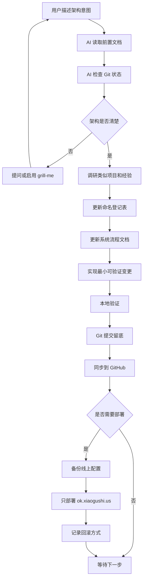
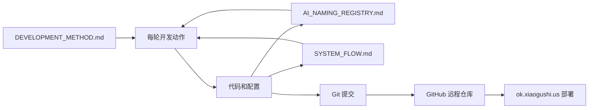
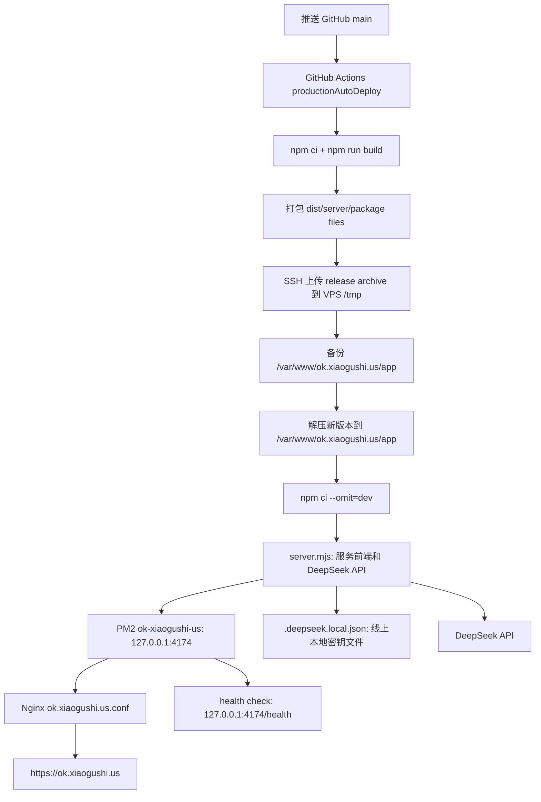
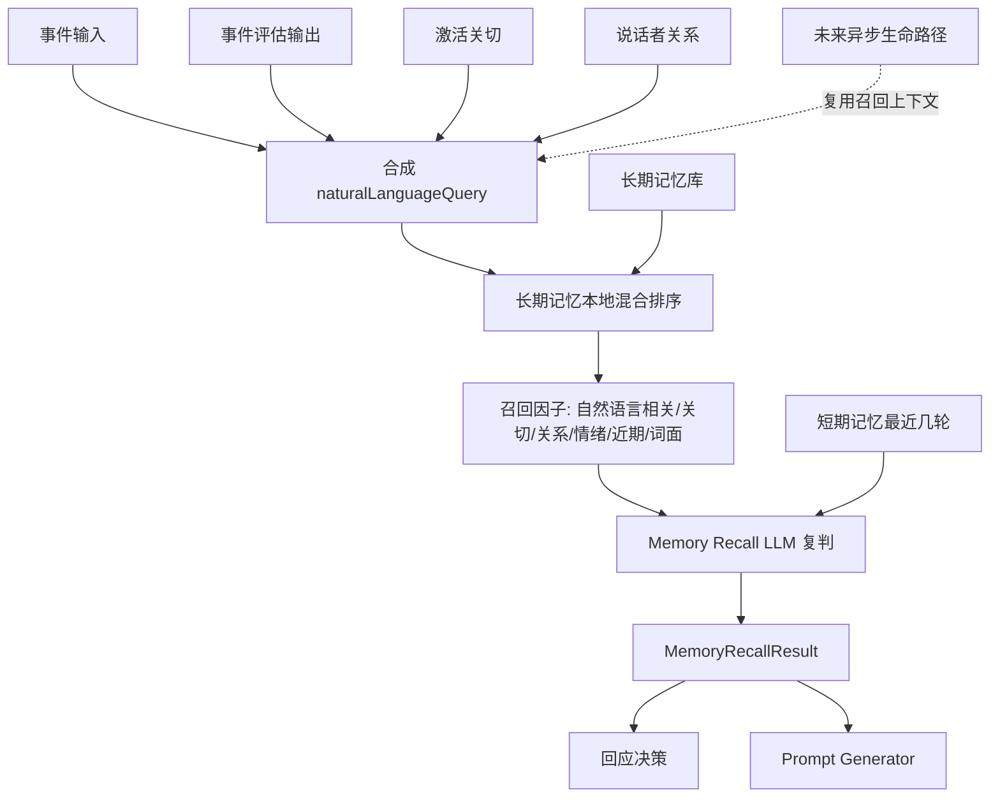
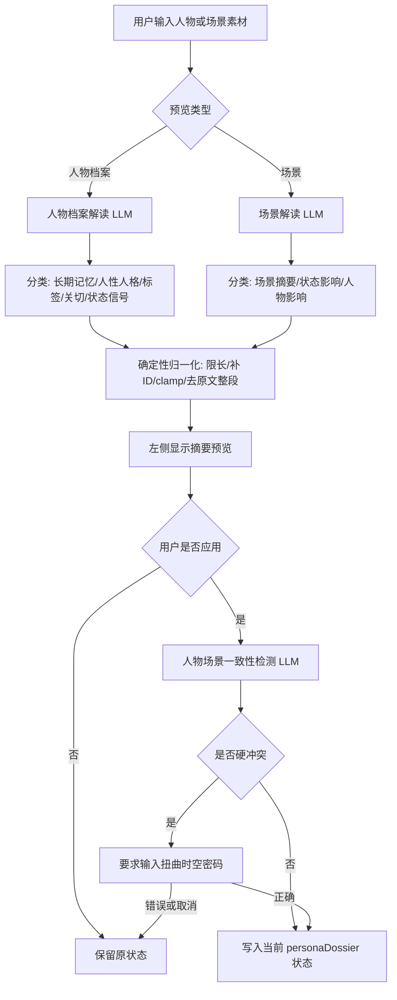
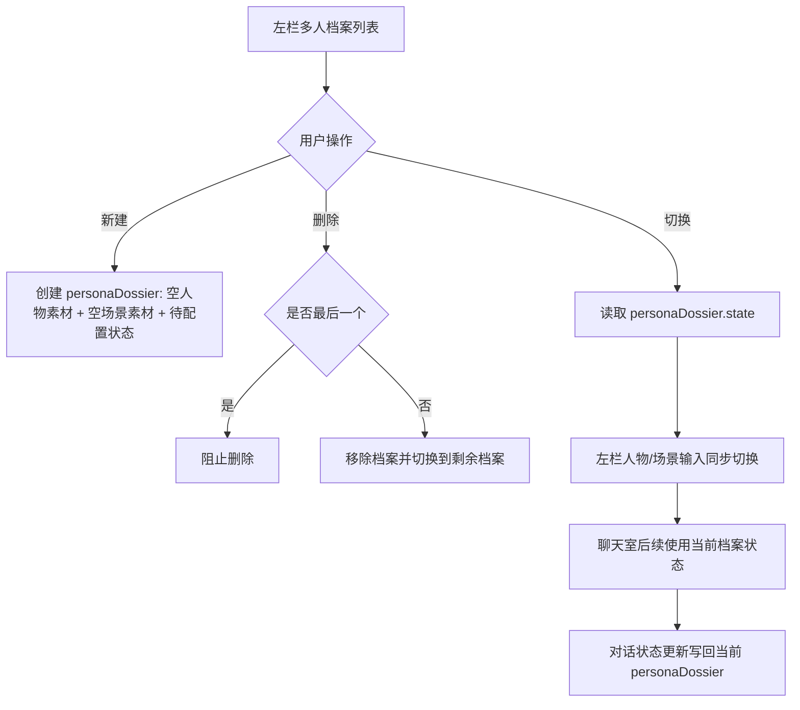
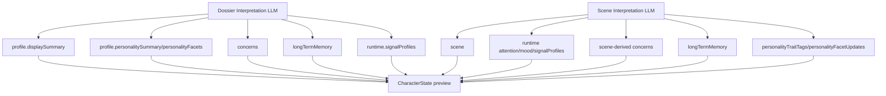
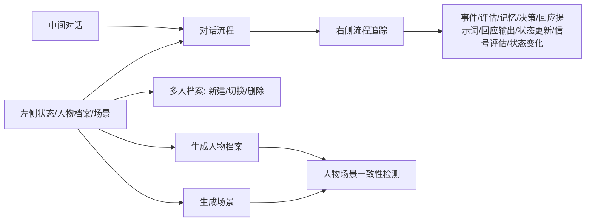

# System Flow

本文档说明系统如何运作、数据如何流动、模块之间如何调用。它既给用户看，也给 AI 后续开发使用。

## 当前阶段

当前已建立第一版本地 MVP：三栏工作台展示多人档案、人物状态、聊天室和流程追踪。系统能根据用户素材预览人物档案和配套场景，并在发送消息后展示多模块 LLM 数据流。

重要约束：Reply LLM 只接收自然语言上下文，只生成角色说出口的话。不能把 JSON、字段名、输出契约、工程术语或类似编程语言的内容混进这一步。

认知模块是另一类 LLM 调用。Appraisal、Memory Recall、Decision、State Update 都是独立的脑区式 LLM 模块；它们可以用结构化输入/输出约束，因为它们不是角色台词生成器，而是系统内部的判断模块。

Memory Recall 不是敏感词召回。触发词可以作为线索，但记忆浮现必须同时参考自然语言相关度、当前关切、说话者关系、情绪显著、近期性和词面线索。当前同步路径先在本地构建混合召回候选，再交给 Memory Recall LLM 复判；未来异步生命路径也复用同一套召回上下文，只是 `source` 从 `sync_response` 变成 `async_life`。

左侧 UI 里的性格标签、能量、情绪、情绪倾向、唤醒度是给人快速观察的摘要。它们由专门的 Runtime Signal Evaluation LLM 模块评估，不由 Reply LLM 直接控制台词。提交给 Reply LLM 的是 `personalitySummary`、`personalityFacets`、`runtime.signalProfiles.*.cognitiveNarrative`、`scene.cognitiveNarrative` 等自然语言综合描述。

人物属性、状态信号和场景叙述只描述内部倾向、形成原因、身体感、关系距离和注意力落点，不能写成“回复应如何”“不要如何”“用什么话术”这类直接指令。Reply Prompt 的作用是把这些自然语言材料过一遍，让回复从人物整体状态中长出来，而不是让某个单独指标指挥台词风格。

人物档案和场景预览也属于认知模块，不是本地字符串拼接。人物档案预览通过 Dossier Interpretation LLM 将用户素材拆成展示摘要、长期记忆、人性/人格、标签、关切和状态信号；场景预览通过 Scene Interpretation LLM 将用户素材拆成场景摘要、状态影响和人物影响。预览应用时写入的是 LLM 解读后的结构化状态，而不是用户原文。

人物档案和场景设置作为 `personaDossier` 成组保存。左侧可以新建、切换和删除档案；切换档案时人物状态、人物素材和场景素材一起切换。应用人物或场景预览前，Profile Scene Consistency LLM 会判断人物与场景是否处于同一世界观、时代和社会语境；现代人物进入古代场景这类硬冲突需要输入本地“扭曲时空密码”才能继续。

DeepSeek 接入必须关闭思考模式。应用固定使用真实 DeepSeek 本地代理和 `deepseek-v4-flash`，不再暴露模拟语言模型选项。代理层对所有 DeepSeek Chat Completions 请求显式传入 `thinking: { type: "disabled" }`，不发送 `reasoning_effort`，并把 `deepseek-reasoner` 纠正为 `deepseek-v4-flash`。

流程追踪面板不是事后 dump。每个模块开始时会自动切换到当前步骤，并显示该模块的输入、流式输出和状态。每个步骤都必须让用户能分清“发给模块的输入”和“模块返回的输出”。

## 总体工作流

## 文档和代码关系

## 生产部署路径

生产自动部署由 `.github/workflows/deploy-production.yml` 执行，触发条件是 `main` 分支 push 或 GitHub Actions 手动触发。工作流使用 GitHub Actions secrets 里的 SSH 凭据进入 VPS，但只允许操作 `/var/www/ok.xiaogushi.us/app`、`/root/ok.xiaogushi.us-backups` 和 PM2 进程 `ok-xiaogushi-us`。线上 `.deepseek.local.json` 不由 GitHub Actions 上传或覆盖。

## 当前 MVP 同步响应路径

## 记忆召回路径

本地混合排序只是候选层，不是最终心理判断。它的责任是避免把整个历史粗暴塞给模型，同时避免只按敏感词命中决定召回。Memory Recall LLM 可以提升“没有词面命中但语义相关”的记忆，也可以压低“只是撞词但语义无关”的记忆。

## 生成预览路径

## 多人档案路径

## 生成预览写回边界

## 当前 UI 结构

## 待确认 MVP 架构问题

开始写业务代码前，需要确认以下信息：

1. MVP 第一版要让用户看到什么可运行结果？
2. 虚拟人的核心能力是什么：对话、记忆、情绪、任务执行、声音、形象，还是其中一部分？
3. 第一版是否需要登录系统？
4. 第一版数据是否需要长期保存？
5. 是否必须接入大模型 API？如果是，使用哪个供应商？
6. 是否已有 UI 草图、流程图或前一段对话内容？
7. GitHub 仓库名称和可见性是什么？

## 当前外部资源

| 资源 | 状态 | 说明 |
| --- | --- | --- |
| 前置对话链接 | blocked | 链接打开后需要登录，AI 无法读取实际内容 |
| GitHub 账号 | known | 用户主页为 `ttmanthatman` |
| GitHub 仓库 | known | `ttmanthatman/virtual-human-flow`，`main` 分支 push 触发自动部署 |
| VPS | known | 仅允许后续部署 `ok.xiaogushi.us` 对应内容 |
| 域名 | known | `ok.xiaogushi.us` |

## 当前模块状态

| 模块 | 状态 | 说明 |
| --- | --- | --- |
| 开发方法 | initialized | 已建立规则文档 |
| 命名登记 | initialized | 已建立 AI 用命名表 |
| 系统流程 | initialized | 已建立初始工作流图 |
| MVP 业务模块 | initialized | 已实现本地可运行的三栏工作台 |
| 多人档案 | initialized | 左侧可新建、切换、删除 `personaDossier`；每个档案绑定人物状态和配套场景素材 |
| 人物档案生成 | initialized | 通过 Dossier Interpretation LLM 重新解读用户素材，生成 profile、concerns、longTermMemory 和 runtime 预览 |
| 人物档案预览 | initialized | 左侧只展示 `profile.displaySummary` 等摘要信息，用户确认后应用 |
| 场景生成 | initialized | 通过 Scene Interpretation LLM 重新解读用户素材，生成 scene、状态影响、人物影响、关切和记忆预览 |
| 场景预览 | initialized | 先显示场景摘要和状态影响预览，用户确认后应用完整状态 |
| 人物场景一致性检测 | initialized | Profile Scene Consistency LLM 判断人物和场景是否硬冲突；硬冲突需要扭曲时空密码继续 |
| 同步对话路径 | initialized | 事件 -> 评估 -> 记忆召回 -> 回应决策 -> 回应提示词 -> 回应输出 -> 状态更新 -> 信号评估 -> 状态变化 |
| 真实 LLM 接入 | initialized | 当前固定使用本地 DeepSeek 代理、`deepseek-v4-flash`、根目录密钥文件、关闭思考模式和流式输出；UI 不提供模拟语言模型 |
| 流程追踪输入输出 | initialized | 每个模块都有输入、输出、状态；执行时自动切换当前模块 |
| 生产部署 | initialized | `ok.xiaogushi.us` 通过 nginx 反代 PM2 进程 `ok-xiaogushi-us`，线上目录 `/var/www/ok.xiaogushi.us/app` |
| 生产自动部署 | initialized | GitHub Actions 在 `main` 分支新版本后自动构建、上传、备份、重启 PM2，并检查 `/health` |
| 异步生命路径 | pending | Memory Consolidation、Concern Decay、Internal Monologue、Proactive Scheduler 尚未实现；记忆召回上下文已预留 `async_life` 来源 |

## 部署记录

| 时间 | 提交/版本 | 域名 | 目录 | 进程 | 备份 | 验证 |
| --- | --- | --- | --- | --- | --- | --- |
| 2026-06-01 | `2a4b378` 后续生产服务补丁 | `https://ok.xiaogushi.us` | `/var/www/ok.xiaogushi.us/app` | PM2 `ok-xiaogushi-us` | `/root/ok.xiaogushi.us-backups/20260601103603` | HTTPS 首页、`/api/deepseek-config`、DeepSeek SSE、浏览器完整对话链路通过 |
| 2026-06-01 | `2e15c71` LLM 解读人物和场景预览 | `https://ok.xiaogushi.us` | `/var/www/ok.xiaogushi.us/app` | PM2 `ok-xiaogushi-us` | `/root/ok.xiaogushi.us-backups/20260601153353` | 本地 build 通过；PM2 online；公网 HTTPS 首页和 `/api/deepseek-config` 通过；浏览器加载新摘要和预览按钮且无 console error |
| 2026-06-02 | `cff06e4` 多人档案、人物场景一致性和生产健康检查 | `https://ok.xiaogushi.us` | `/var/www/ok.xiaogushi.us/app` | PM2 `ok-xiaogushi-us` | `/root/ok.xiaogushi.us-backups/20260601160930` | 本地 build 通过；PM2 online；公网 `/health` 返回 OK；公网 `/api/deepseek-config` 返回 DeepSeek 已保存；Playwright 看到多人档案、预览人物档案、预览场景且无 console error |
| 2026-06-02 | `bc0d286` GitHub Actions 自动部署修复 | `https://ok.xiaogushi.us` | `/var/www/ok.xiaogushi.us/app` | PM2 `ok-xiaogushi-us` | `/root/ok.xiaogushi.us-backups/20260602035444.tgz` | GitHub Actions run #2 success；公网 `/health` 返回 OK；PM2 `ok-xiaogushi-us` online |
